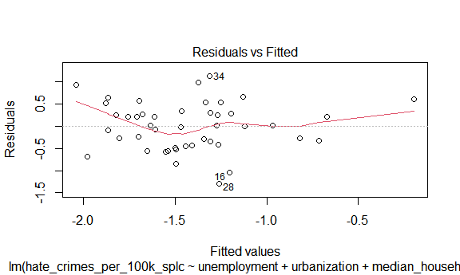
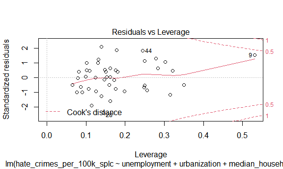
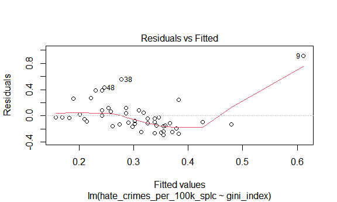
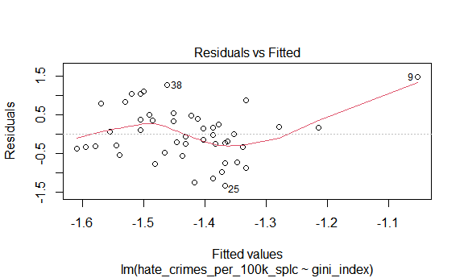
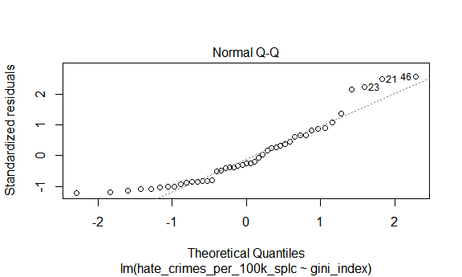
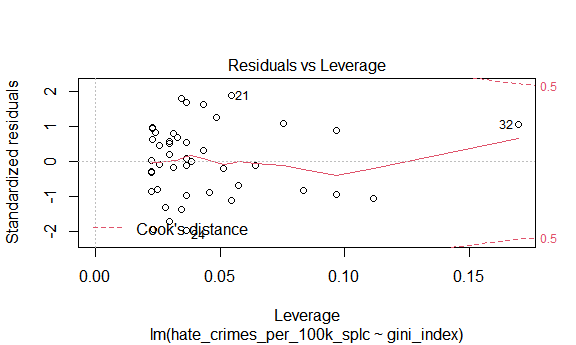

Data Exploration
================
Hanfei Qi, Anmol Singh, Wuraola Olawole, Ting Lian
12/4/2020

### Data Exploration:

Read data and make sure factors are factors.

``` r
crime_df = 
  read_csv("data/HateCrimes.csv") %>% 
  mutate(
    unemployment = factor(unemployment),
    urbanization = factor(urbanization),
    hate_crimes_per_100k_splc = as.numeric(hate_crimes_per_100k_splc)
  )
```

Descriptive statistics

``` r
my_controls =  tableby.control(
               total = F,
               test=F,  
               numeric.stats = c("meansd", "medianq1q3", "range", "Nmiss2"),
               cat.stats = c("countpct", "Nmiss2"),
               stats.labels = list(
               meansd = "Mean (SD)",
               medianq1q3 = "Median (Q1, Q3)",
               range = "Min - Max",
               Nmiss2 = "Missing",
               countpct = "N (%)"))

tab = tableby( ~ hate_crimes_per_100k_splc + unemployment + urbanization + median_household_income +   perc_population_with_high_school_degree + perc_non_citizen + gini_index + perc_non_white, 
               data = crime_df, 
               control = my_controls)

summary(tab, title = "Descriptive Statistics: Hate Crime Data", text = T)
```

    ## 
    ## Table: Descriptive Statistics: Hate Crime Data
    ## 
    ## |                                        |          Overall (N=51)          |
    ## |:---------------------------------------|:--------------------------------:|
    ## |hate_crimes_per_100k_splc               |                                  |
    ## |-  Mean (SD)                            |          0.304 (0.253)           |
    ## |-  Median (Q1, Q3)                      |       0.226 (0.143, 0.357)       |
    ## |-  Min - Max                            |          0.067 - 1.522           |
    ## |-  Missing                              |                4                 |
    ## |unemployment                            |                                  |
    ## |-  high                                 |            24 (47.1%)            |
    ## |-  low                                  |            27 (52.9%)            |
    ## |-  Missing                              |                0                 |
    ## |urbanization                            |                                  |
    ## |-  high                                 |            24 (47.1%)            |
    ## |-  low                                  |            27 (52.9%)            |
    ## |-  Missing                              |                0                 |
    ## |median_household_income                 |                                  |
    ## |-  Mean (SD)                            |       55223.608 (9208.478)       |
    ## |-  Median (Q1, Q3)                      | 54916.000 (48657.000, 60719.000) |
    ## |-  Min - Max                            |      35521.000 - 76165.000       |
    ## |-  Missing                              |                0                 |
    ## |perc_population_with_high_school_degree |                                  |
    ## |-  Mean (SD)                            |          0.869 (0.034)           |
    ## |-  Median (Q1, Q3)                      |       0.874 (0.841, 0.898)       |
    ## |-  Min - Max                            |          0.799 - 0.918           |
    ## |-  Missing                              |                0                 |
    ## |perc_non_citizen                        |                                  |
    ## |-  Mean (SD)                            |          0.055 (0.031)           |
    ## |-  Median (Q1, Q3)                      |       0.045 (0.030, 0.080)       |
    ## |-  Min - Max                            |          0.010 - 0.130           |
    ## |-  Missing                              |                3                 |
    ## |gini_index                              |                                  |
    ## |-  Mean (SD)                            |          0.454 (0.021)           |
    ## |-  Median (Q1, Q3)                      |       0.454 (0.440, 0.467)       |
    ## |-  Min - Max                            |          0.419 - 0.532           |
    ## |-  Missing                              |                0                 |
    ## |perc_non_white                          |                                  |
    ## |-  Mean (SD)                            |          0.316 (0.165)           |
    ## |-  Median (Q1, Q3)                      |       0.280 (0.195, 0.420)       |
    ## |-  Min - Max                            |          0.060 - 0.810           |
    ## |-  Missing                              |                0                 |

Comment: there are 4 NA’s in variable `hate_crimes_per_100k_splc` and 3
NA’s in variable `perc_non_citizen`.

Code to remove NA’s (not sure if we wanna do that).

``` r
crime_df_no_na = 
  read_csv("data/HateCrimes.csv", na = c("", "N/A")) %>% 
  mutate(
    unemployment = factor(unemployment),
    urbanization = factor(urbanization),
    hate_crimes_per_100k_splc = as.numeric(hate_crimes_per_100k_splc)
  ) %>% 
  na.omit()
```

Distribution of the outcome

``` r
crime_df_no_na %>% 
  ggplot(aes(x = hate_crimes_per_100k_splc)) + geom_density()
```


Comment: we need transformation

``` r
mod = 
  lm(hate_crimes_per_100k_splc ~ unemployment + urbanization + median_household_income +   perc_population_with_high_school_degree + perc_non_citizen + gini_index + perc_non_white, 
      data = crime_df_no_na)

boxcox(mod)
```


Perform the tranformation.

``` r
trans_df = 
  crime_df_no_na %>% 
  mutate(
    hate_crimes_per_100k_splc = log(hate_crimes_per_100k_splc)
  )

trans_df %>% 
  ggplot(aes(x = hate_crimes_per_100k_splc)) + geom_density()
```


Looks good\!

Plots before and after transformation.

``` r
plot(mod)
```


``` r
mod_trans = lm(hate_crimes_per_100k_splc ~ unemployment + urbanization + median_household_income +   perc_population_with_high_school_degree + perc_non_citizen + gini_index + perc_non_white, 
      data = trans_df)

plot(mod_trans)
```



Plot crime rate by states.

``` r
crime_df_no_na %>% 
  mutate(state = fct_reorder(state, hate_crimes_per_100k_splc)) %>% 
  ggplot(aes(x = state, y = hate_crimes_per_100k_splc)) + 
  geom_point() + 
  geom_line() +
  theme(axis.text.x = element_text(angle = 60, hjust = 1))
```

    ## geom_path: Each group consists of only one observation. Do you need to adjust
    ## the group aesthetic?


Comment: A wired point in `District of Columbia`. The rate of `Oregon`
is slightly higher than other states. I will also consider `Minnesota`,
`Massachusetts`, `Washington` as potential outliers.

### Modeling:

**Test if association between income inequality and hate crimes holds
true:**

``` r
income_hate_model_full_data = crime_df%>%
  lm(hate_crimes_per_100k_splc~gini_index,data=.)

income_hate_model_full_data%>%
  broom::tidy()%>%
  knitr::kable(caption = "Testing Association between Income Inequality and Hate Crime using all the data", format = "html")
```

<table>

<caption>

Testing Association between Income Inequality and Hate Crime using all
the data

</caption>

<thead>

<tr>

<th style="text-align:left;">

term

</th>

<th style="text-align:right;">

estimate

</th>

<th style="text-align:right;">

std.error

</th>

<th style="text-align:right;">

statistic

</th>

<th style="text-align:right;">

p.value

</th>

</tr>

</thead>

<tbody>

<tr>

<td style="text-align:left;">

(Intercept)

</td>

<td style="text-align:right;">

\-1.527463

</td>

<td style="text-align:right;">

0.7833043

</td>

<td style="text-align:right;">

\-1.950025

</td>

<td style="text-align:right;">

0.0574197

</td>

</tr>

<tr>

<td style="text-align:left;">

gini\_index

</td>

<td style="text-align:right;">

4.020510

</td>

<td style="text-align:right;">

1.7177215

</td>

<td style="text-align:right;">

2.340606

</td>

<td style="text-align:right;">

0.0237445

</td>

</tr>

</tbody>

</table>

``` r
income_hate_model_trans = crime_df%>%
  mutate(
    hate_crimes_per_100k_splc = log(hate_crimes_per_100k_splc)
  )%>%
  lm(hate_crimes_per_100k_splc~gini_index,data=.)

income_hate_model_trans%>%
  broom::tidy()%>%
  knitr::kable(caption = "Testing Association between Income Inequality and Hate Crime using log transformed data", format = "html")
```

<table>

<caption>

Testing Association between Income Inequality and Hate Crime using log
transformed data

</caption>

<thead>

<tr>

<th style="text-align:left;">

term

</th>

<th style="text-align:right;">

estimate

</th>

<th style="text-align:right;">

std.error

</th>

<th style="text-align:right;">

statistic

</th>

<th style="text-align:right;">

p.value

</th>

</tr>

</thead>

<tbody>

<tr>

<td style="text-align:left;">

(Intercept)

</td>

<td style="text-align:right;">

\-3.675547

</td>

<td style="text-align:right;">

2.195289

</td>

<td style="text-align:right;">

\-1.674288

</td>

<td style="text-align:right;">

0.1010115

</td>

</tr>

<tr>

<td style="text-align:left;">

gini\_index

</td>

<td style="text-align:right;">

4.931538

</td>

<td style="text-align:right;">

4.814087

</td>

<td style="text-align:right;">

1.024398

</td>

<td style="text-align:right;">

0.3111231

</td>

</tr>

</tbody>

</table>

p-value is only significant for data which is not transformed or when
outliers are not removed. Lets check model diagnostics to confirm
though.

**Model Diagnostics:**

``` r
#For original data:

plot(income_hate_model_full_data)
```



``` r
#For log-transformed data

plot(income_hate_model_trans)
```



Looking at leverage plots for both models there are definite outliers,
will remove and check models again.

**Confirming Outliers:**

``` r
lower = quantile(crime_df$hate_crimes_per_100k_splc,0.25,na.rm = T)-(1.5*IQR(crime_df$hate_crimes_per_100k_splc,na.rm=T)) #determining lower bound for outlier
upper = quantile(crime_df$hate_crimes_per_100k_splc,0.75, na.rm=T)+(1.5*IQR(crime_df$hate_crimes_per_100k_splc,na.rm=T)) #determining upper bound for outlier
outliers = crime_df$state[(crime_df$hate_crimes_per_100k_splc>upper |crime_df$hate_crimes_per_100k_splc<lower)] #finding states that are outliers
```

**Removing Outliers:**

``` r
crime_df_no_outlier = crime_df%>%
  filter(!state %in% outliers)
```

``` r
#For original data without outliers:

income_hate_model_no_outlier = lm(hate_crimes_per_100k_splc~gini_index,data=crime_df_no_outlier)

plot(income_hate_model_no_outlier)
```



``` r
#For log-transformed data with no outliers

income_hate_model_trans_no_outlier = crime_df_no_outlier%>%
  mutate(
    hate_crimes_per_100k_splc = log(hate_crimes_per_100k_splc)
  )%>%
  lm(hate_crimes_per_100k_splc~gini_index,data=.)

plot(income_hate_model_trans_no_outlier)
```



Plots are closer to model assumptions without outliers present.

**Correlation Matrix of All Variables:**

``` r
corr_matrix = trans_df%>%
  mutate(unemployment = ifelse(unemployment=="high",1,0),
         urbanization = ifelse(urbanization=="high",1,0))%>%
  dplyr::select(-state)%>%
         cor()%>%
  data.frame()

corr_matrix%>%
  knitr::kable(caption = "Correlation Matrix for all variables except for State in Data Set", format = "html")
```

<table>

<caption>

Correlation Matrix for all variables except for State in Data Set

</caption>

<thead>

<tr>

<th style="text-align:left;">

</th>

<th style="text-align:right;">

unemployment

</th>

<th style="text-align:right;">

urbanization

</th>

<th style="text-align:right;">

median\_household\_income

</th>

<th style="text-align:right;">

perc\_population\_with\_high\_school\_degree

</th>

<th style="text-align:right;">

perc\_non\_citizen

</th>

<th style="text-align:right;">

gini\_index

</th>

<th style="text-align:right;">

perc\_non\_white

</th>

<th style="text-align:right;">

hate\_crimes\_per\_100k\_splc

</th>

</tr>

</thead>

<tbody>

<tr>

<td style="text-align:left;">

unemployment

</td>

<td style="text-align:right;">

1.0000000

</td>

<td style="text-align:right;">

0.2435648

</td>

<td style="text-align:right;">

\-0.2538367

</td>

<td style="text-align:right;">

\-0.4526394

</td>

<td style="text-align:right;">

0.2408705

</td>

<td style="text-align:right;">

0.4089989

</td>

<td style="text-align:right;">

0.4281971

</td>

<td style="text-align:right;">

\-0.1680668

</td>

</tr>

<tr>

<td style="text-align:left;">

urbanization

</td>

<td style="text-align:right;">

0.2435648

</td>

<td style="text-align:right;">

1.0000000

</td>

<td style="text-align:right;">

0.2613532

</td>

<td style="text-align:right;">

\-0.1591792

</td>

<td style="text-align:right;">

0.6807743

</td>

<td style="text-align:right;">

0.4298763

</td>

<td style="text-align:right;">

0.5085536

</td>

<td style="text-align:right;">

0.1837247

</td>

</tr>

<tr>

<td style="text-align:left;">

median\_household\_income

</td>

<td style="text-align:right;">

\-0.2538367

</td>

<td style="text-align:right;">

0.2613532

</td>

<td style="text-align:right;">

1.0000000

</td>

<td style="text-align:right;">

0.6511383

</td>

<td style="text-align:right;">

0.3017394

</td>

<td style="text-align:right;">

\-0.1295216

</td>

<td style="text-align:right;">

0.0390540

</td>

<td style="text-align:right;">

0.3109375

</td>

</tr>

<tr>

<td style="text-align:left;">

perc\_population\_with\_high\_school\_degree

</td>

<td style="text-align:right;">

\-0.4526394

</td>

<td style="text-align:right;">

\-0.1591792

</td>

<td style="text-align:right;">

0.6511383

</td>

<td style="text-align:right;">

1.0000000

</td>

<td style="text-align:right;">

\-0.2621288

</td>

<td style="text-align:right;">

\-0.5371591

</td>

<td style="text-align:right;">

\-0.4958932

</td>

<td style="text-align:right;">

0.2960528

</td>

</tr>

<tr>

<td style="text-align:left;">

perc\_non\_citizen

</td>

<td style="text-align:right;">

0.2408705

</td>

<td style="text-align:right;">

0.6807743

</td>

<td style="text-align:right;">

0.3017394

</td>

<td style="text-align:right;">

\-0.2621288

</td>

<td style="text-align:right;">

1.0000000

</td>

<td style="text-align:right;">

0.4798976

</td>

<td style="text-align:right;">

0.7526102

</td>

<td style="text-align:right;">

0.1369321

</td>

</tr>

<tr>

<td style="text-align:left;">

gini\_index

</td>

<td style="text-align:right;">

0.4089989

</td>

<td style="text-align:right;">

0.4298763

</td>

<td style="text-align:right;">

\-0.1295216

</td>

<td style="text-align:right;">

\-0.5371591

</td>

<td style="text-align:right;">

0.4798976

</td>

<td style="text-align:right;">

1.0000000

</td>

<td style="text-align:right;">

0.5484035

</td>

<td style="text-align:right;">

0.2185514

</td>

</tr>

<tr>

<td style="text-align:left;">

perc\_non\_white

</td>

<td style="text-align:right;">

0.4281971

</td>

<td style="text-align:right;">

0.5085536

</td>

<td style="text-align:right;">

0.0390540

</td>

<td style="text-align:right;">

\-0.4958932

</td>

<td style="text-align:right;">

0.7526102

</td>

<td style="text-align:right;">

0.5484035

</td>

<td style="text-align:right;">

1.0000000

</td>

<td style="text-align:right;">

\-0.0066948

</td>

</tr>

<tr>

<td style="text-align:left;">

hate\_crimes\_per\_100k\_splc

</td>

<td style="text-align:right;">

\-0.1680668

</td>

<td style="text-align:right;">

0.1837247

</td>

<td style="text-align:right;">

0.3109375

</td>

<td style="text-align:right;">

0.2960528

</td>

<td style="text-align:right;">

0.1369321

</td>

<td style="text-align:right;">

0.2185514

</td>

<td style="text-align:right;">

\-0.0066948

</td>

<td style="text-align:right;">

1.0000000

</td>

</tr>

</tbody>

</table>

``` r
highly_correlated = data.frame(Correlation = corr_matrix[corr_matrix>=abs(0.6)&corr_matrix<abs(1)])

highly_correlated =  highly_correlated[!duplicated(highly_correlated),]%>%
  data.frame()%>%
  rename(Correlation = ".")%>%
  mutate(Variable_1 = c("urbanization","median_household_income","perc_non_citizen"),Variable_2 = c("perc_non_citizen","perc_population_with_high_school_degree","perc_non_white"))

highly_correlated%>%
  knitr::kable(caption = "Variables that are Highly Correlated (Correlation >= absolute value (0.6))", format = "html")
```

<table>

<caption>

Variables that are Highly Correlated (Correlation \>= absolute value
(0.6))

</caption>

<thead>

<tr>

<th style="text-align:right;">

Correlation

</th>

<th style="text-align:left;">

Variable\_1

</th>

<th style="text-align:left;">

Variable\_2

</th>

</tr>

</thead>

<tbody>

<tr>

<td style="text-align:right;">

0.6807743

</td>

<td style="text-align:left;">

urbanization

</td>

<td style="text-align:left;">

perc\_non\_citizen

</td>

</tr>

<tr>

<td style="text-align:right;">

0.6511383

</td>

<td style="text-align:left;">

median\_household\_income

</td>

<td style="text-align:left;">

perc\_population\_with\_high\_school\_degree

</td>

</tr>

<tr>

<td style="text-align:right;">

0.7526102

</td>

<td style="text-align:left;">

perc\_non\_citizen

</td>

<td style="text-align:left;">

perc\_non\_white

</td>

</tr>

</tbody>

</table>

Studies have shown that high income is correlated with increased
education and thus it would make sense that the median income and
percentage of high school diploma holders are highly correlated
[\[1\]](https://budgetmodel.wharton.upenn.edu/issues/2016/2/22/education-and-income-growth).
Furthermore, a study conducted by the pew research center found that
only 17.7% of immigrants are white non-hispanic which makes sense why
the percentage of non citizens and the percentage of white people are
very highly correlated as well
[\[2\]](https://www.pewresearch.org/hispanic/2020/08/20/facts-on-u-s-immigrants-current-data/).
Since these sets of variables are so highly correlated it would only be
beneficial to adjust for one from each set in our model due to
multicollinearity.

**Stepwise Regression procedure for Removing highly-correlated
predictors:**

``` r
library(leaps)
```

    ## Warning: package 'leaps' was built under R version 4.0.3

``` r
#start with model using all predictors: 
crime_trans = crime_df_no_outlier%>%
  mutate(
    hate_crimes_per_100k_splc = log(hate_crimes_per_100k_splc)
  )%>%
  drop_na()

mod_trans = lm(hate_crimes_per_100k_splc ~ unemployment + urbanization + median_household_income +   perc_population_with_high_school_degree + perc_non_citizen + gini_index + perc_non_white,data=crime_trans)

summary(mod_trans)
```

    ## 
    ## Call:
    ## lm(formula = hate_crimes_per_100k_splc ~ unemployment + urbanization + 
    ##     median_household_income + perc_population_with_high_school_degree + 
    ##     perc_non_citizen + gini_index + perc_non_white, data = crime_trans)
    ## 
    ## Residuals:
    ##     Min      1Q  Median      3Q     Max 
    ## -1.0548 -0.3860  0.0577  0.2990  1.1378 
    ## 
    ## Coefficients:
    ##                                           Estimate Std. Error t value Pr(>|t|)
    ## (Intercept)                             -1.194e+01  6.423e+00  -1.859   0.0714
    ## unemploymentlow                          3.282e-01  2.005e-01   1.637   0.1106
    ## urbanizationlow                         -1.377e-01  2.396e-01  -0.575   0.5692
    ## median_household_income                 -3.352e-06  1.628e-05  -0.206   0.8381
    ## perc_population_with_high_school_degree  6.892e+00  5.335e+00   1.292   0.2049
    ## perc_non_citizen                        -3.026e-02  5.153e+00  -0.006   0.9953
    ## gini_index                               1.015e+01  7.079e+00   1.434   0.1604
    ## perc_non_white                          -1.428e-01  1.038e+00  -0.138   0.8913
    ##                                          
    ## (Intercept)                             .
    ## unemploymentlow                          
    ## urbanizationlow                          
    ## median_household_income                  
    ## perc_population_with_high_school_degree  
    ## perc_non_citizen                         
    ## gini_index                               
    ## perc_non_white                           
    ## ---
    ## Signif. codes:  0 '***' 0.001 '**' 0.01 '*' 0.05 '.' 0.1 ' ' 1
    ## 
    ## Residual standard error: 0.5468 on 35 degrees of freedom
    ## Multiple R-squared:  0.2192, Adjusted R-squared:  0.0631 
    ## F-statistic: 1.404 on 7 and 35 DF,  p-value: 0.2348

``` r
#start stepwise regression procedure :

mod_tidy = mod_trans%>%
  broom::tidy()

step(mod_trans, direction='backward')
```

    ## Start:  AIC=-44.77
    ## hate_crimes_per_100k_splc ~ unemployment + urbanization + median_household_income + 
    ##     perc_population_with_high_school_degree + perc_non_citizen + 
    ##     gini_index + perc_non_white
    ## 
    ##                                           Df Sum of Sq    RSS     AIC
    ## - perc_non_citizen                         1   0.00001 10.463 -46.774
    ## - perc_non_white                           1   0.00566 10.469 -46.750
    ## - median_household_income                  1   0.01267 10.476 -46.722
    ## - urbanization                             1   0.09870 10.562 -46.370
    ## <none>                                                 10.463 -44.774
    ## - perc_population_with_high_school_degree  1   0.49883 10.962 -44.771
    ## - gini_index                               1   0.61487 11.078 -44.318
    ## - unemployment                             1   0.80098 11.264 -43.602
    ## 
    ## Step:  AIC=-46.77
    ## hate_crimes_per_100k_splc ~ unemployment + urbanization + median_household_income + 
    ##     perc_population_with_high_school_degree + gini_index + perc_non_white
    ## 
    ##                                           Df Sum of Sq    RSS     AIC
    ## - perc_non_white                           1   0.00851 10.472 -48.739
    ## - median_household_income                  1   0.01440 10.477 -48.715
    ## - urbanization                             1   0.11541 10.579 -48.302
    ## <none>                                                 10.463 -46.774
    ## - perc_population_with_high_school_degree  1   0.50889 10.972 -46.732
    ## - gini_index                               1   0.61961 11.083 -46.300
    ## - unemployment                             1   0.81655 11.280 -45.542
    ## 
    ## Step:  AIC=-48.74
    ## hate_crimes_per_100k_splc ~ unemployment + urbanization + median_household_income + 
    ##     perc_population_with_high_school_degree + gini_index
    ## 
    ##                                           Df Sum of Sq    RSS     AIC
    ## - median_household_income                  1   0.02725 10.499 -50.627
    ## - urbanization                             1   0.10708 10.579 -50.301
    ## <none>                                                 10.472 -48.739
    ## - gini_index                               1   0.63081 11.102 -48.223
    ## - perc_population_with_high_school_degree  1   0.76738 11.239 -47.698
    ## - unemployment                             1   0.89292 11.365 -47.220
    ## 
    ## Step:  AIC=-50.63
    ## hate_crimes_per_100k_splc ~ unemployment + urbanization + perc_population_with_high_school_degree + 
    ##     gini_index
    ## 
    ##                                           Df Sum of Sq    RSS     AIC
    ## - urbanization                             1   0.08043 10.579 -52.299
    ## <none>                                                 10.499 -50.627
    ## - gini_index                               1   0.62337 11.122 -50.147
    ## - unemployment                             1   0.87727 11.376 -49.176
    ## - perc_population_with_high_school_degree  1   0.95942 11.458 -48.867
    ## 
    ## Step:  AIC=-52.3
    ## hate_crimes_per_100k_splc ~ unemployment + perc_population_with_high_school_degree + 
    ##     gini_index
    ## 
    ##                                           Df Sum of Sq    RSS     AIC
    ## <none>                                                 10.579 -52.299
    ## - unemployment                             1   0.83599 11.415 -51.028
    ## - gini_index                               1   1.00103 11.580 -50.411
    ## - perc_population_with_high_school_degree  1   1.09580 11.675 -50.061

    ## 
    ## Call:
    ## lm(formula = hate_crimes_per_100k_splc ~ unemployment + perc_population_with_high_school_degree + 
    ##     gini_index, data = crime_trans)
    ## 
    ## Coefficients:
    ##                             (Intercept)  
    ##                                -12.8782  
    ##                         unemploymentlow  
    ##                                  0.3223  
    ## perc_population_with_high_school_degree  
    ##                                  6.8299  
    ##                              gini_index  
    ##                                 11.6847

``` r
#Final Recommended Model:

final_rec = lm(formula = hate_crimes_per_100k_splc ~ unemployment + perc_population_with_high_school_degree + gini_index, data = crime_trans)

summary(final_rec)
```

    ## 
    ## Call:
    ## lm(formula = hate_crimes_per_100k_splc ~ unemployment + perc_population_with_high_school_degree + 
    ##     gini_index, data = crime_trans)
    ## 
    ## Residuals:
    ##     Min      1Q  Median      3Q     Max 
    ## -1.0599 -0.4014  0.0557  0.3175  1.2095 
    ## 
    ## Coefficients:
    ##                                         Estimate Std. Error t value Pr(>|t|)  
    ## (Intercept)                             -12.8782     5.0597  -2.545   0.0150 *
    ## unemploymentlow                           0.3223     0.1836   1.756   0.0870 .
    ## perc_population_with_high_school_degree   6.8299     3.3981   2.010   0.0514 .
    ## gini_index                               11.6847     6.0826   1.921   0.0621 .
    ## ---
    ## Signif. codes:  0 '***' 0.001 '**' 0.01 '*' 0.05 '.' 0.1 ' ' 1
    ## 
    ## Residual standard error: 0.5208 on 39 degrees of freedom
    ## Multiple R-squared:  0.2106, Adjusted R-squared:  0.1499 
    ## F-statistic: 3.468 on 3 and 39 DF,  p-value: 0.02514

``` r
final_rec_df = final_rec%>%broom::tidy()

#Comparing R-squared of final model vs model containing all variables:

#Final Recommendation from Stepwise Regression:

final_rec%>%broom::glance()
```

    ## # A tibble: 1 x 12
    ##   r.squared adj.r.squared sigma statistic p.value    df logLik   AIC   BIC
    ##       <dbl>         <dbl> <dbl>     <dbl>   <dbl> <dbl>  <dbl> <dbl> <dbl>
    ## 1     0.211         0.150 0.521      3.47  0.0251     3  -30.9  71.7  80.5
    ## # ... with 3 more variables: deviance <dbl>, df.residual <int>, nobs <int>

``` r
#Model with all variables:

mod_trans%>%broom::glance()
```

    ## # A tibble: 1 x 12
    ##   r.squared adj.r.squared sigma statistic p.value    df logLik   AIC   BIC
    ##       <dbl>         <dbl> <dbl>     <dbl>   <dbl> <dbl>  <dbl> <dbl> <dbl>
    ## 1     0.219        0.0631 0.547      1.40   0.235     7  -30.6  79.3  95.1
    ## # ... with 3 more variables: deviance <dbl>, df.residual <int>, nobs <int>

R squared is around the same for both models, however final model has
138% improvement in adusted R squared compared to model that contains
all variables.
