Data Exploration
================
Hanfei Qi, Anmol Singh, Wuraola Olawole, Ting Lian
12/4/2020

### Data Exploration:

Read data and make sure factors are factors.

``` r
crime_df = 
  read_csv("data/HateCrimes.csv") %>% 
  mutate(
    unemployment = factor(unemployment),
    urbanization = factor(urbanization),
    hate_crimes_per_100k_splc = as.numeric(hate_crimes_per_100k_splc)
  )
```

Descriptive statistics

``` r
my_controls =  tableby.control(
               total = F,
               test=F,  
               numeric.stats = c("meansd", "medianq1q3", "range", "Nmiss2"),
               cat.stats = c("countpct", "Nmiss2"),
               stats.labels = list(
               meansd = "Mean (SD)",
               medianq1q3 = "Median (Q1, Q3)",
               range = "Min - Max",
               Nmiss2 = "Missing",
               countpct = "N (%)"))

tab = tableby( ~ hate_crimes_per_100k_splc + unemployment + urbanization + median_household_income +   perc_population_with_high_school_degree + perc_non_citizen + gini_index + perc_non_white, 
               data = crime_df, 
               control = my_controls)

summary(tab, title = "Descriptive Statistics: Hate Crime Data", text = T)
```

    ## 
    ## Table: Descriptive Statistics: Hate Crime Data
    ## 
    ## |                                        |          Overall (N=51)          |
    ## |:---------------------------------------|:--------------------------------:|
    ## |hate_crimes_per_100k_splc               |                                  |
    ## |-  Mean (SD)                            |          0.304 (0.253)           |
    ## |-  Median (Q1, Q3)                      |       0.226 (0.143, 0.357)       |
    ## |-  Min - Max                            |          0.067 - 1.522           |
    ## |-  Missing                              |                4                 |
    ## |unemployment                            |                                  |
    ## |-  high                                 |            24 (47.1%)            |
    ## |-  low                                  |            27 (52.9%)            |
    ## |-  Missing                              |                0                 |
    ## |urbanization                            |                                  |
    ## |-  high                                 |            24 (47.1%)            |
    ## |-  low                                  |            27 (52.9%)            |
    ## |-  Missing                              |                0                 |
    ## |median_household_income                 |                                  |
    ## |-  Mean (SD)                            |       55223.608 (9208.478)       |
    ## |-  Median (Q1, Q3)                      | 54916.000 (48657.000, 60719.000) |
    ## |-  Min - Max                            |      35521.000 - 76165.000       |
    ## |-  Missing                              |                0                 |
    ## |perc_population_with_high_school_degree |                                  |
    ## |-  Mean (SD)                            |          0.869 (0.034)           |
    ## |-  Median (Q1, Q3)                      |       0.874 (0.841, 0.898)       |
    ## |-  Min - Max                            |          0.799 - 0.918           |
    ## |-  Missing                              |                0                 |
    ## |perc_non_citizen                        |                                  |
    ## |-  Mean (SD)                            |          0.055 (0.031)           |
    ## |-  Median (Q1, Q3)                      |       0.045 (0.030, 0.080)       |
    ## |-  Min - Max                            |          0.010 - 0.130           |
    ## |-  Missing                              |                3                 |
    ## |gini_index                              |                                  |
    ## |-  Mean (SD)                            |          0.454 (0.021)           |
    ## |-  Median (Q1, Q3)                      |       0.454 (0.440, 0.467)       |
    ## |-  Min - Max                            |          0.419 - 0.532           |
    ## |-  Missing                              |                0                 |
    ## |perc_non_white                          |                                  |
    ## |-  Mean (SD)                            |          0.316 (0.165)           |
    ## |-  Median (Q1, Q3)                      |       0.280 (0.195, 0.420)       |
    ## |-  Min - Max                            |          0.060 - 0.810           |
    ## |-  Missing                              |                0                 |

Comment: there are 4 NA’s in variable `hate_crimes_per_100k_splc` and 3
NA’s in variable `perc_non_citizen`.

Code to remove NA’s (not sure if we wanna do that).

``` r
crime_df_no_na = 
  read_csv("data/HateCrimes.csv", na = c("", "N/A")) %>% 
  mutate(
    unemployment = factor(unemployment),
    urbanization = factor(urbanization),
    hate_crimes_per_100k_splc = as.numeric(hate_crimes_per_100k_splc)
  ) %>% 
  na.omit()
```

Distribution of the outcome

``` r
crime_df_no_na %>% 
  ggplot(aes(x = hate_crimes_per_100k_splc)) + geom_density()
```


Comment: we need transformation

``` r
mod = 
  lm(hate_crimes_per_100k_splc ~ unemployment + urbanization + median_household_income +   perc_population_with_high_school_degree + perc_non_citizen + gini_index + perc_non_white, 
      data = crime_df_no_na)

boxcox(mod)
```


Perform the tranformation.

``` r
trans_df = 
  crime_df_no_na %>% 
  mutate(
    hate_crimes_per_100k_splc = log(hate_crimes_per_100k_splc)
  )

trans_df %>% 
  ggplot(aes(x = hate_crimes_per_100k_splc)) + geom_density()
```


Looks good\!

Plots before and after transformation.

``` r
plot(mod)
```

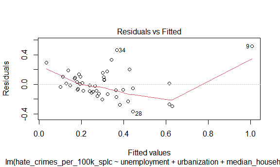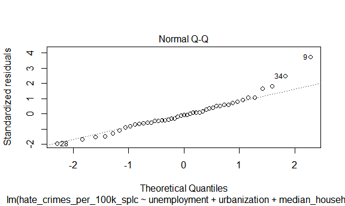

``` r
mod_trans = lm(hate_crimes_per_100k_splc ~ unemployment + urbanization + median_household_income +   perc_population_with_high_school_degree + perc_non_citizen + gini_index + perc_non_white, 
      data = trans_df)

plot(mod_trans)
```


Plot crime rate by states.

``` r
crime_df_no_na %>% 
  mutate(state = fct_reorder(state, hate_crimes_per_100k_splc)) %>% 
  ggplot(aes(x = state, y = hate_crimes_per_100k_splc)) + 
  geom_point() + 
  geom_line() +
  theme(axis.text.x = element_text(angle = 60, hjust = 1))
```

    ## geom_path: Each group consists of only one observation. Do you need to adjust
    ## the group aesthetic?


Comment: A wired point in `District of Columbia`. The rate of `Oregon`
is slightly higher than other states. I will also consider `Minnesota`,
`Massachusetts`, `Washington` as potential outliers.

### Modeling:

**Test if association between income inequality and hate crimes holds
true:**

``` r
income_hate_model_full_data = crime_df%>%
  lm(hate_crimes_per_100k_splc~gini_index,data=.)

income_hate_model_full_data%>%
  broom::tidy()%>%
  knitr::kable(caption = "Testing Association between Income Inequality and Hate Crime using all the data", format = "html")
```

<table>

<caption>

Testing Association between Income Inequality and Hate Crime using all
the data

</caption>

<thead>

<tr>

<th style="text-align:left;">

term

</th>

<th style="text-align:right;">

estimate

</th>

<th style="text-align:right;">

std.error

</th>

<th style="text-align:right;">

statistic

</th>

<th style="text-align:right;">

p.value

</th>

</tr>

</thead>

<tbody>

<tr>

<td style="text-align:left;">

(Intercept)

</td>

<td style="text-align:right;">

\-1.527463

</td>

<td style="text-align:right;">

0.7833043

</td>

<td style="text-align:right;">

\-1.950025

</td>

<td style="text-align:right;">

0.0574197

</td>

</tr>

<tr>

<td style="text-align:left;">

gini\_index

</td>

<td style="text-align:right;">

4.020510

</td>

<td style="text-align:right;">

1.7177215

</td>

<td style="text-align:right;">

2.340606

</td>

<td style="text-align:right;">

0.0237445

</td>

</tr>

</tbody>

</table>

``` r
income_hate_model_trans = crime_df%>%
  mutate(
    hate_crimes_per_100k_splc = log(hate_crimes_per_100k_splc)
  )%>%
  lm(hate_crimes_per_100k_splc~gini_index,data=.)

income_hate_model_trans%>%
  broom::tidy()%>%
  knitr::kable(caption = "Testing Association between Income Inequality and Hate Crime using log transformed data", format = "html")
```

<table>

<caption>

Testing Association between Income Inequality and Hate Crime using log
transformed data

</caption>

<thead>

<tr>

<th style="text-align:left;">

term

</th>

<th style="text-align:right;">

estimate

</th>

<th style="text-align:right;">

std.error

</th>

<th style="text-align:right;">

statistic

</th>

<th style="text-align:right;">

p.value

</th>

</tr>

</thead>

<tbody>

<tr>

<td style="text-align:left;">

(Intercept)

</td>

<td style="text-align:right;">

\-3.675547

</td>

<td style="text-align:right;">

2.195289

</td>

<td style="text-align:right;">

\-1.674288

</td>

<td style="text-align:right;">

0.1010115

</td>

</tr>

<tr>

<td style="text-align:left;">

gini\_index

</td>

<td style="text-align:right;">

4.931538

</td>

<td style="text-align:right;">

4.814087

</td>

<td style="text-align:right;">

1.024398

</td>

<td style="text-align:right;">

0.3111231

</td>

</tr>

</tbody>

</table>

p-value is only significant for data which is not transformed or when
outliers are not removed. Lets check model diagnostics to confirm
though.

**Model Diagnostics:**

``` r
#For original data:

plot(income_hate_model_full_data)
```


``` r
#For log-transformed data

plot(income_hate_model_trans)
```

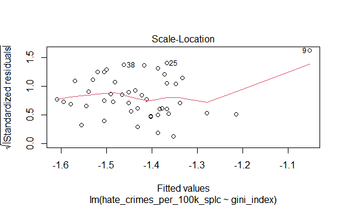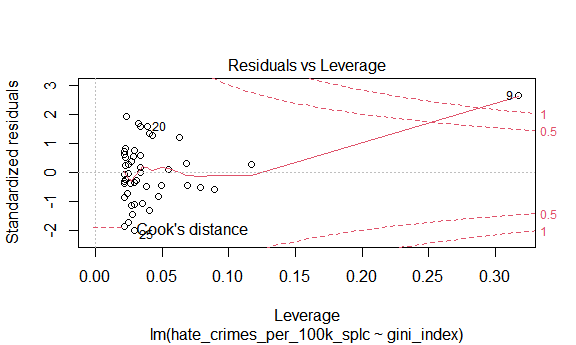

Looking at leverage plots for both models there are definite outliers,
will remove and check models again.

**Confirming Outliers:**

``` r
lower = quantile(crime_df$hate_crimes_per_100k_splc,0.25,na.rm = T)-(1.5*IQR(crime_df$hate_crimes_per_100k_splc,na.rm=T)) #determining lower bound for outlier
upper = quantile(crime_df$hate_crimes_per_100k_splc,0.75, na.rm=T)+(1.5*IQR(crime_df$hate_crimes_per_100k_splc,na.rm=T)) #determining upper bound for outlier
outliers = crime_df$state[(crime_df$hate_crimes_per_100k_splc>upper |crime_df$hate_crimes_per_100k_splc<lower)] #finding states that are outliers
```

**Removing Outliers:**

``` r
crime_df_no_outlier = crime_df%>%
  filter(!state %in% outliers)
```

``` r
#For original data without outliers:

income_hate_model_no_outlier = lm(hate_crimes_per_100k_splc~gini_index,data=crime_df_no_outlier)

plot(income_hate_model_no_outlier)
```

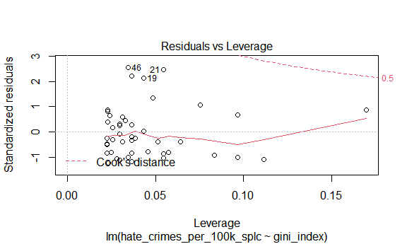

``` r
#For log-transformed data with no outliers

income_hate_model_trans_no_outlier = crime_df_no_outlier%>%
  mutate(
    hate_crimes_per_100k_splc = log(hate_crimes_per_100k_splc)
  )%>%
  lm(hate_crimes_per_100k_splc~gini_index,data=.)

plot(income_hate_model_trans_no_outlier)
```

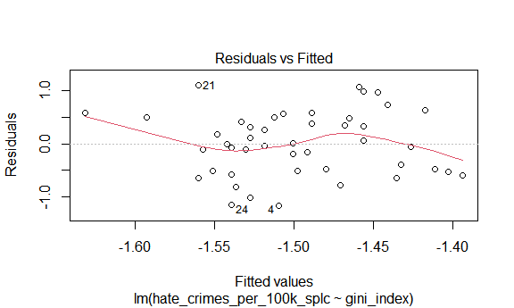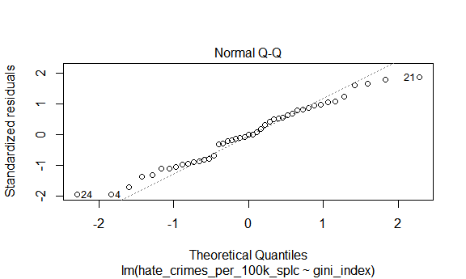

Plots are closer to model assumptions without outliers present.

**Correlation Matrix of All Variables:**

``` r
corr_matrix = trans_df%>%
  mutate(unemployment = ifelse(unemployment=="high",1,0),
         urbanization = ifelse(urbanization=="high",1,0))%>%
  dplyr::select(-state)%>%
         cor()%>%
  data.frame()

corr_matrix%>%
  knitr::kable(caption = "Correlation Matrix for all variables except for State in Data Set", format = "html")
```

<table>

<caption>

Correlation Matrix for all variables except for State in Data Set

</caption>

<thead>

<tr>

<th style="text-align:left;">

</th>

<th style="text-align:right;">

unemployment

</th>

<th style="text-align:right;">

urbanization

</th>

<th style="text-align:right;">

median\_household\_income

</th>

<th style="text-align:right;">

perc\_population\_with\_high\_school\_degree

</th>

<th style="text-align:right;">

perc\_non\_citizen

</th>

<th style="text-align:right;">

gini\_index

</th>

<th style="text-align:right;">

perc\_non\_white

</th>

<th style="text-align:right;">

hate\_crimes\_per\_100k\_splc

</th>

</tr>

</thead>

<tbody>

<tr>

<td style="text-align:left;">

unemployment

</td>

<td style="text-align:right;">

1.0000000

</td>

<td style="text-align:right;">

0.2435648

</td>

<td style="text-align:right;">

\-0.2538367

</td>

<td style="text-align:right;">

\-0.4526394

</td>

<td style="text-align:right;">

0.2408705

</td>

<td style="text-align:right;">

0.4089989

</td>

<td style="text-align:right;">

0.4281971

</td>

<td style="text-align:right;">

\-0.1680668

</td>

</tr>

<tr>

<td style="text-align:left;">

urbanization

</td>

<td style="text-align:right;">

0.2435648

</td>

<td style="text-align:right;">

1.0000000

</td>

<td style="text-align:right;">

0.2613532

</td>

<td style="text-align:right;">

\-0.1591792

</td>

<td style="text-align:right;">

0.6807743

</td>

<td style="text-align:right;">

0.4298763

</td>

<td style="text-align:right;">

0.5085536

</td>

<td style="text-align:right;">

0.1837247

</td>

</tr>

<tr>

<td style="text-align:left;">

median\_household\_income

</td>

<td style="text-align:right;">

\-0.2538367

</td>

<td style="text-align:right;">

0.2613532

</td>

<td style="text-align:right;">

1.0000000

</td>

<td style="text-align:right;">

0.6511383

</td>

<td style="text-align:right;">

0.3017394

</td>

<td style="text-align:right;">

\-0.1295216

</td>

<td style="text-align:right;">

0.0390540

</td>

<td style="text-align:right;">

0.3109375

</td>

</tr>

<tr>

<td style="text-align:left;">

perc\_population\_with\_high\_school\_degree

</td>

<td style="text-align:right;">

\-0.4526394

</td>

<td style="text-align:right;">

\-0.1591792

</td>

<td style="text-align:right;">

0.6511383

</td>

<td style="text-align:right;">

1.0000000

</td>

<td style="text-align:right;">

\-0.2621288

</td>

<td style="text-align:right;">

\-0.5371591

</td>

<td style="text-align:right;">

\-0.4958932

</td>

<td style="text-align:right;">

0.2960528

</td>

</tr>

<tr>

<td style="text-align:left;">

perc\_non\_citizen

</td>

<td style="text-align:right;">

0.2408705

</td>

<td style="text-align:right;">

0.6807743

</td>

<td style="text-align:right;">

0.3017394

</td>

<td style="text-align:right;">

\-0.2621288

</td>

<td style="text-align:right;">

1.0000000

</td>

<td style="text-align:right;">

0.4798976

</td>

<td style="text-align:right;">

0.7526102

</td>

<td style="text-align:right;">

0.1369321

</td>

</tr>

<tr>

<td style="text-align:left;">

gini\_index

</td>

<td style="text-align:right;">

0.4089989

</td>

<td style="text-align:right;">

0.4298763

</td>

<td style="text-align:right;">

\-0.1295216

</td>

<td style="text-align:right;">

\-0.5371591

</td>

<td style="text-align:right;">

0.4798976

</td>

<td style="text-align:right;">

1.0000000

</td>

<td style="text-align:right;">

0.5484035

</td>

<td style="text-align:right;">

0.2185514

</td>

</tr>

<tr>

<td style="text-align:left;">

perc\_non\_white

</td>

<td style="text-align:right;">

0.4281971

</td>

<td style="text-align:right;">

0.5085536

</td>

<td style="text-align:right;">

0.0390540

</td>

<td style="text-align:right;">

\-0.4958932

</td>

<td style="text-align:right;">

0.7526102

</td>

<td style="text-align:right;">

0.5484035

</td>

<td style="text-align:right;">

1.0000000

</td>

<td style="text-align:right;">

\-0.0066948

</td>

</tr>

<tr>

<td style="text-align:left;">

hate\_crimes\_per\_100k\_splc

</td>

<td style="text-align:right;">

\-0.1680668

</td>

<td style="text-align:right;">

0.1837247

</td>

<td style="text-align:right;">

0.3109375

</td>

<td style="text-align:right;">

0.2960528

</td>

<td style="text-align:right;">

0.1369321

</td>

<td style="text-align:right;">

0.2185514

</td>

<td style="text-align:right;">

\-0.0066948

</td>

<td style="text-align:right;">

1.0000000

</td>

</tr>

</tbody>

</table>

``` r
highly_correlated = data.frame(Correlation = corr_matrix[corr_matrix>=abs(0.6)&corr_matrix<abs(1)])

highly_correlated =  highly_correlated[!duplicated(highly_correlated),]%>%
  data.frame()%>%
  rename(Correlation = ".")%>%
  mutate(Variable_1 = c("urbanization","median_household_income","perc_non_citizen"),Variable_2 = c("perc_non_citizen","perc_population_with_high_school_degree","perc_non_white"))

highly_correlated%>%
  knitr::kable(caption = "Variables that are Highly Correlated (Correlation >= absolute value (0.6))", format = "html")
```

<table>

<caption>

Variables that are Highly Correlated (Correlation \>= absolute value
(0.6))

</caption>

<thead>

<tr>

<th style="text-align:right;">

Correlation

</th>

<th style="text-align:left;">

Variable\_1

</th>

<th style="text-align:left;">

Variable\_2

</th>

</tr>

</thead>

<tbody>

<tr>

<td style="text-align:right;">

0.6807743

</td>

<td style="text-align:left;">

urbanization

</td>

<td style="text-align:left;">

perc\_non\_citizen

</td>

</tr>

<tr>

<td style="text-align:right;">

0.6511383

</td>

<td style="text-align:left;">

median\_household\_income

</td>

<td style="text-align:left;">

perc\_population\_with\_high\_school\_degree

</td>

</tr>

<tr>

<td style="text-align:right;">

0.7526102

</td>

<td style="text-align:left;">

perc\_non\_citizen

</td>

<td style="text-align:left;">

perc\_non\_white

</td>

</tr>

</tbody>

</table>

Studies have shown that high income is correlated with increased
education and thus it would make sense that the median income and
percentage of high school diploma holders are highly correlated
[\[1\]](https://budgetmodel.wharton.upenn.edu/issues/2016/2/22/education-and-income-growth).
Furthermore, a study conducted by the pew research center found that
only 17.7% of immigrants are white non-hispanic which makes sense why
the percentage of non citizens and the percentage of white people are
very highly correlated as well
[\[2\]](https://www.pewresearch.org/hispanic/2020/08/20/facts-on-u-s-immigrants-current-data/).
Since these sets of variables are so highly correlated it would only be
beneficial to adjust for one from each set in our model due to
multicollinearity.

**Stepwise Regression procedure for Removing highly-correlated
predictors:**

``` r
library(leaps)
```

    ## Warning: package 'leaps' was built under R version 4.0.3

``` r
#start with model using all predictors: 
crime_trans = crime_df_no_outlier%>%
  mutate(
    hate_crimes_per_100k_splc = log(hate_crimes_per_100k_splc)
  )%>%
  drop_na()

mod_trans = lm(hate_crimes_per_100k_splc ~ unemployment + urbanization + median_household_income +   perc_population_with_high_school_degree + perc_non_citizen + gini_index + perc_non_white,data=crime_trans)

summary(mod_trans)
```

    ## 
    ## Call:
    ## lm(formula = hate_crimes_per_100k_splc ~ unemployment + urbanization + 
    ##     median_household_income + perc_population_with_high_school_degree + 
    ##     perc_non_citizen + gini_index + perc_non_white, data = crime_trans)
    ## 
    ## Residuals:
    ##     Min      1Q  Median      3Q     Max 
    ## -1.0548 -0.3860  0.0577  0.2990  1.1378 
    ## 
    ## Coefficients:
    ##                                           Estimate Std. Error t value Pr(>|t|)
    ## (Intercept)                             -1.194e+01  6.423e+00  -1.859   0.0714
    ## unemploymentlow                          3.282e-01  2.005e-01   1.637   0.1106
    ## urbanizationlow                         -1.377e-01  2.396e-01  -0.575   0.5692
    ## median_household_income                 -3.352e-06  1.628e-05  -0.206   0.8381
    ## perc_population_with_high_school_degree  6.892e+00  5.335e+00   1.292   0.2049
    ## perc_non_citizen                        -3.026e-02  5.153e+00  -0.006   0.9953
    ## gini_index                               1.015e+01  7.079e+00   1.434   0.1604
    ## perc_non_white                          -1.428e-01  1.038e+00  -0.138   0.8913
    ##                                          
    ## (Intercept)                             .
    ## unemploymentlow                          
    ## urbanizationlow                          
    ## median_household_income                  
    ## perc_population_with_high_school_degree  
    ## perc_non_citizen                         
    ## gini_index                               
    ## perc_non_white                           
    ## ---
    ## Signif. codes:  0 '***' 0.001 '**' 0.01 '*' 0.05 '.' 0.1 ' ' 1
    ## 
    ## Residual standard error: 0.5468 on 35 degrees of freedom
    ## Multiple R-squared:  0.2192, Adjusted R-squared:  0.0631 
    ## F-statistic: 1.404 on 7 and 35 DF,  p-value: 0.2348

``` r
#start stepwise regression procedure :

mod_tidy = mod_trans%>%
  broom::tidy()

step(mod_trans, direction='backward')
```

    ## Start:  AIC=-44.77
    ## hate_crimes_per_100k_splc ~ unemployment + urbanization + median_household_income + 
    ##     perc_population_with_high_school_degree + perc_non_citizen + 
    ##     gini_index + perc_non_white
    ## 
    ##                                           Df Sum of Sq    RSS     AIC
    ## - perc_non_citizen                         1   0.00001 10.463 -46.774
    ## - perc_non_white                           1   0.00566 10.469 -46.750
    ## - median_household_income                  1   0.01267 10.476 -46.722
    ## - urbanization                             1   0.09870 10.562 -46.370
    ## <none>                                                 10.463 -44.774
    ## - perc_population_with_high_school_degree  1   0.49883 10.962 -44.771
    ## - gini_index                               1   0.61487 11.078 -44.318
    ## - unemployment                             1   0.80098 11.264 -43.602
    ## 
    ## Step:  AIC=-46.77
    ## hate_crimes_per_100k_splc ~ unemployment + urbanization + median_household_income + 
    ##     perc_population_with_high_school_degree + gini_index + perc_non_white
    ## 
    ##                                           Df Sum of Sq    RSS     AIC
    ## - perc_non_white                           1   0.00851 10.472 -48.739
    ## - median_household_income                  1   0.01440 10.477 -48.715
    ## - urbanization                             1   0.11541 10.579 -48.302
    ## <none>                                                 10.463 -46.774
    ## - perc_population_with_high_school_degree  1   0.50889 10.972 -46.732
    ## - gini_index                               1   0.61961 11.083 -46.300
    ## - unemployment                             1   0.81655 11.280 -45.542
    ## 
    ## Step:  AIC=-48.74
    ## hate_crimes_per_100k_splc ~ unemployment + urbanization + median_household_income + 
    ##     perc_population_with_high_school_degree + gini_index
    ## 
    ##                                           Df Sum of Sq    RSS     AIC
    ## - median_household_income                  1   0.02725 10.499 -50.627
    ## - urbanization                             1   0.10708 10.579 -50.301
    ## <none>                                                 10.472 -48.739
    ## - gini_index                               1   0.63081 11.102 -48.223
    ## - perc_population_with_high_school_degree  1   0.76738 11.239 -47.698
    ## - unemployment                             1   0.89292 11.365 -47.220
    ## 
    ## Step:  AIC=-50.63
    ## hate_crimes_per_100k_splc ~ unemployment + urbanization + perc_population_with_high_school_degree + 
    ##     gini_index
    ## 
    ##                                           Df Sum of Sq    RSS     AIC
    ## - urbanization                             1   0.08043 10.579 -52.299
    ## <none>                                                 10.499 -50.627
    ## - gini_index                               1   0.62337 11.122 -50.147
    ## - unemployment                             1   0.87727 11.376 -49.176
    ## - perc_population_with_high_school_degree  1   0.95942 11.458 -48.867
    ## 
    ## Step:  AIC=-52.3
    ## hate_crimes_per_100k_splc ~ unemployment + perc_population_with_high_school_degree + 
    ##     gini_index
    ## 
    ##                                           Df Sum of Sq    RSS     AIC
    ## <none>                                                 10.579 -52.299
    ## - unemployment                             1   0.83599 11.415 -51.028
    ## - gini_index                               1   1.00103 11.580 -50.411
    ## - perc_population_with_high_school_degree  1   1.09580 11.675 -50.061

    ## 
    ## Call:
    ## lm(formula = hate_crimes_per_100k_splc ~ unemployment + perc_population_with_high_school_degree + 
    ##     gini_index, data = crime_trans)
    ## 
    ## Coefficients:
    ##                             (Intercept)  
    ##                                -12.8782  
    ##                         unemploymentlow  
    ##                                  0.3223  
    ## perc_population_with_high_school_degree  
    ##                                  6.8299  
    ##                              gini_index  
    ##                                 11.6847

``` r
#Final Recommended Model:

final_rec = lm(formula = hate_crimes_per_100k_splc ~ unemployment + perc_population_with_high_school_degree + gini_index, data = crime_trans)

summary(final_rec)
```

    ## 
    ## Call:
    ## lm(formula = hate_crimes_per_100k_splc ~ unemployment + perc_population_with_high_school_degree + 
    ##     gini_index, data = crime_trans)
    ## 
    ## Residuals:
    ##     Min      1Q  Median      3Q     Max 
    ## -1.0599 -0.4014  0.0557  0.3175  1.2095 
    ## 
    ## Coefficients:
    ##                                         Estimate Std. Error t value Pr(>|t|)  
    ## (Intercept)                             -12.8782     5.0597  -2.545   0.0150 *
    ## unemploymentlow                           0.3223     0.1836   1.756   0.0870 .
    ## perc_population_with_high_school_degree   6.8299     3.3981   2.010   0.0514 .
    ## gini_index                               11.6847     6.0826   1.921   0.0621 .
    ## ---
    ## Signif. codes:  0 '***' 0.001 '**' 0.01 '*' 0.05 '.' 0.1 ' ' 1
    ## 
    ## Residual standard error: 0.5208 on 39 degrees of freedom
    ## Multiple R-squared:  0.2106, Adjusted R-squared:  0.1499 
    ## F-statistic: 3.468 on 3 and 39 DF,  p-value: 0.02514

``` r
final_rec_df = final_rec%>%broom::tidy()

#Comparing R-squared of final model vs model containing all variables:

#Final Recommendation from Stepwise Regression:

final_rec %>% broom::glance()
```

    ## # A tibble: 1 x 12
    ##   r.squared adj.r.squared sigma statistic p.value    df logLik   AIC   BIC
    ##       <dbl>         <dbl> <dbl>     <dbl>   <dbl> <dbl>  <dbl> <dbl> <dbl>
    ## 1     0.211         0.150 0.521      3.47  0.0251     3  -30.9  71.7  80.5
    ## # ... with 3 more variables: deviance <dbl>, df.residual <int>, nobs <int>

``` r
#Model with all variables:

mod_trans %>% broom::glance()
```

    ## # A tibble: 1 x 12
    ##   r.squared adj.r.squared sigma statistic p.value    df logLik   AIC   BIC
    ##       <dbl>         <dbl> <dbl>     <dbl>   <dbl> <dbl>  <dbl> <dbl> <dbl>
    ## 1     0.219        0.0631 0.547      1.40   0.235     7  -30.6  79.3  95.1
    ## # ... with 3 more variables: deviance <dbl>, df.residual <int>, nobs <int>

R squared is around the same for both models, however final model has
138% improvement in adjusted R squared compared to model that contains
all variables.

# Explore interactions of all variables

``` r
crime =
  crime_trans %>%
 dplyr::select(-state)
```

Check for 2-way interactions between all predictors

``` r
lm.fit = lm(hate_crimes_per_100k_splc ~ (.)^2, data = crime)
lm_fit_df = broom::tidy(lm.fit)
lm_fit_df
```

    ## # A tibble: 29 x 5
    ##    term                                    estimate  std.error statistic p.value
    ##    <chr>                                      <dbl>      <dbl>     <dbl>   <dbl>
    ##  1 (Intercept)                          -447.          3.32e+2   -1.35    0.199 
    ##  2 unemploymentlow                        18.4         1.94e+1    0.947   0.360 
    ##  3 urbanizationlow                        28.7         2.92e+1    0.983   0.342 
    ##  4 median_household_income                -0.00394     1.77e-3   -2.23    0.0427
    ##  5 perc_population_with_high_school_de~  752.          3.96e+2    1.90    0.0786
    ##  6 perc_non_citizen                       83.2         8.58e+2    0.0970  0.924 
    ##  7 gini_index                            862.          6.57e+2    1.31    0.211 
    ##  8 perc_non_white                         59.3         2.03e+2    0.293   0.774 
    ##  9 unemploymentlow:urbanizationlow         0.798       1.05e+0    0.764   0.458 
    ## 10 unemploymentlow:median_household_in~    0.000258    9.72e-5    2.65    0.0188
    ## # ... with 19 more rows

``` r
# obtain significant interactions
all_int =
  broom::tidy(lm.fit) %>%
 slice(9:29) %>%
  filter(p.value < 0.05)

all_int # these are the significant interactions present in our data
```

    ## # A tibble: 4 x 5
    ##   term                                      estimate std.error statistic p.value
    ##   <chr>                                        <dbl>     <dbl>     <dbl>   <dbl>
    ## 1 unemploymentlow:median_household_income   0.000258   9.72e-5      2.65  0.0188
    ## 2 urbanizationlow:median_household_income   0.000270   1.21e-4      2.22  0.0431
    ## 3 urbanizationlow:perc_population_with_h~ -62.2        2.78e+1     -2.24  0.0421
    ## 4 median_household_income:gini_index        0.00769    3.02e-3      2.55  0.0232

From the analysis above, we see 4 significant interactions: unemployment
and median household income, urbanization and median household income,
urbanization and perc\_population with HS degree, and finally
median\_household income and gini index.

``` r
# Unemployment and median household income
reg_med<-lm(hate_crimes_per_100k_splc ~ median_household_income *unemployment, data = crime)
  summary(reg_med)
```

    ## 
    ## Call:
    ## lm(formula = hate_crimes_per_100k_splc ~ median_household_income * 
    ##     unemployment, data = crime)
    ## 
    ## Residuals:
    ##      Min       1Q   Median       3Q      Max 
    ## -0.94931 -0.37985  0.06987  0.35528  1.25644 
    ## 
    ## Coefficients:
    ##                                           Estimate Std. Error t value Pr(>|t|)
    ## (Intercept)                             -1.970e+00  7.261e-01  -2.713  0.00987
    ## median_household_income                  5.490e-06  1.375e-05   0.399  0.69187
    ## unemploymentlow                         -1.126e-01  1.103e+00  -0.102  0.91919
    ## median_household_income:unemploymentlow  7.899e-06  1.981e-05   0.399  0.69234
    ##                                           
    ## (Intercept)                             **
    ## median_household_income                   
    ## unemploymentlow                           
    ## median_household_income:unemploymentlow   
    ## ---
    ## Signif. codes:  0 '***' 0.001 '**' 0.01 '*' 0.05 '.' 0.1 ' ' 1
    ## 
    ## Residual standard error: 0.5454 on 39 degrees of freedom
    ## Multiple R-squared:  0.1344, Adjusted R-squared:  0.06782 
    ## F-statistic: 2.018 on 3 and 39 DF,  p-value: 0.1272

``` r
    interact_plot(reg_med, pred = median_household_income, modx = unemployment )
```


``` r
# high unemployment
  int_1<-filter(crime, unemployment=="high") 
    reg_1<-lm(hate_crimes_per_100k_splc ~ median_household_income, data=int_1)
      broom::tidy(reg_1) #  not significant
```

    ## # A tibble: 2 x 5
    ##   term                       estimate std.error statistic p.value
    ##   <chr>                         <dbl>     <dbl>     <dbl>   <dbl>
    ## 1 (Intercept)             -1.97       0.739        -2.66   0.0153
    ## 2 median_household_income  0.00000549 0.0000140     0.392  0.699

``` r
# low unemployment
  int_2<-filter(crime, unemployment=="low") 
    reg_2<-lm(hate_crimes_per_100k_splc ~ median_household_income, data=int_2)
     broom::tidy(reg_2) # not significant
```

    ## # A tibble: 2 x 5
    ##   term                      estimate std.error statistic p.value
    ##   <chr>                        <dbl>     <dbl>     <dbl>   <dbl>
    ## 1 (Intercept)             -2.08      0.815        -2.55   0.0189
    ## 2 median_household_income  0.0000134 0.0000140     0.955  0.351

``` r
# Urbanization and median household income
reg_med_2<-lm(hate_crimes_per_100k_splc ~ median_household_income* urbanization, data = crime)
summary(reg_med_2)
```

    ## 
    ## Call:
    ## lm(formula = hate_crimes_per_100k_splc ~ median_household_income * 
    ##     urbanization, data = crime)
    ## 
    ## Residuals:
    ##      Min       1Q   Median       3Q      Max 
    ## -1.29800 -0.43155  0.02884  0.36844  1.00236 
    ## 
    ## Coefficients:
    ##                                           Estimate Std. Error t value Pr(>|t|)
    ## (Intercept)                             -2.756e+00  8.296e-01  -3.322  0.00195
    ## median_household_income                  2.309e-05  1.442e-05   1.601  0.11740
    ## urbanizationlow                          8.797e-01  1.114e+00   0.790  0.43441
    ## median_household_income:urbanizationlow -1.688e-05  2.001e-05  -0.843  0.40416
    ##                                           
    ## (Intercept)                             **
    ## median_household_income                   
    ## urbanizationlow                           
    ## median_household_income:urbanizationlow   
    ## ---
    ## Signif. codes:  0 '***' 0.001 '**' 0.01 '*' 0.05 '.' 0.1 ' ' 1
    ## 
    ## Residual standard error: 0.5639 on 39 degrees of freedom
    ## Multiple R-squared:  0.07467,    Adjusted R-squared:  0.003492 
    ## F-statistic: 1.049 on 3 and 39 DF,  p-value: 0.3817

``` r
interact_plot(reg_med_2, pred = median_household_income, modx = urbanization )
```

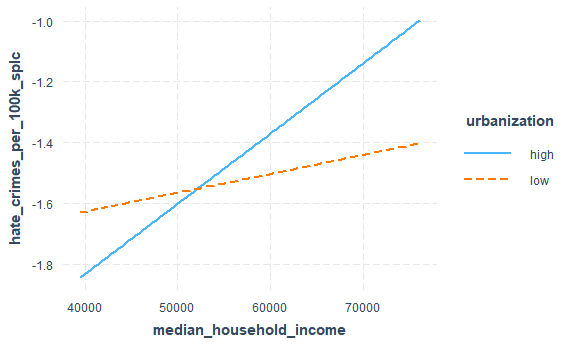

``` r
# high urbanization
  int_3<-filter(crime, urbanization=="high") 
    reg_3<-lm(hate_crimes_per_100k_splc ~ median_household_income, data=int_3)
      broom::tidy(reg_3) #  not significant
```

    ## # A tibble: 2 x 5
    ##   term                      estimate std.error statistic p.value
    ##   <chr>                        <dbl>     <dbl>     <dbl>   <dbl>
    ## 1 (Intercept)             -2.76      0.831         -3.32 0.00344
    ## 2 median_household_income  0.0000231 0.0000144      1.60 0.126

``` r
# low urbanization
  int_4<-filter(crime, urbanization=="low") 
    reg_4<-lm(hate_crimes_per_100k_splc ~ median_household_income, data=int_4)
     broom::tidy(reg_4) # not significant
```

    ## # A tibble: 2 x 5
    ##   term                       estimate std.error statistic p.value
    ##   <chr>                         <dbl>     <dbl>     <dbl>   <dbl>
    ## 1 (Intercept)             -1.88       0.742        -2.53   0.0205
    ## 2 median_household_income  0.00000621 0.0000139     0.448  0.659

``` r
# Urbanization and perc_population with HS degree
reg_per<-lm(hate_crimes_per_100k_splc ~ perc_population_with_high_school_degree* urbanization, data=crime)
  summary(reg_per)
```

    ## 
    ## Call:
    ## lm(formula = hate_crimes_per_100k_splc ~ perc_population_with_high_school_degree * 
    ##     urbanization, data = crime)
    ## 
    ## Residuals:
    ##     Min      1Q  Median      3Q     Max 
    ## -1.2244 -0.3935  0.1048  0.3976  0.9315 
    ## 
    ## Coefficients:
    ##                                                         Estimate Std. Error
    ## (Intercept)                                               -8.759      3.448
    ## perc_population_with_high_school_degree                    8.509      4.007
    ## urbanizationlow                                            4.155      4.534
    ## perc_population_with_high_school_degree:urbanizationlow   -5.004      5.237
    ##                                                         t value Pr(>|t|)  
    ## (Intercept)                                              -2.540   0.0152 *
    ## perc_population_with_high_school_degree                   2.124   0.0401 *
    ## urbanizationlow                                           0.917   0.3650  
    ## perc_population_with_high_school_degree:urbanizationlow  -0.956   0.3452  
    ## ---
    ## Signif. codes:  0 '***' 0.001 '**' 0.01 '*' 0.05 '.' 0.1 ' ' 1
    ## 
    ## Residual standard error: 0.5457 on 39 degrees of freedom
    ## Multiple R-squared:  0.1333, Adjusted R-squared:  0.06663 
    ## F-statistic: 1.999 on 3 and 39 DF,  p-value: 0.13

``` r
    interact_plot(reg_per, pred = perc_population_with_high_school_degree, modx = urbanization )
```


``` r
# high urbanization
reg_5<-lm(hate_crimes_per_100k_splc ~ perc_population_with_high_school_degree, data=int_3)
  summary(reg_5) # significant!
```

    ## 
    ## Call:
    ## lm(formula = hate_crimes_per_100k_splc ~ perc_population_with_high_school_degree, 
    ##     data = int_3)
    ## 
    ## Residuals:
    ##     Min      1Q  Median      3Q     Max 
    ## -1.2244 -0.3066  0.1164  0.3769  0.7376 
    ## 
    ## Coefficients:
    ##                                         Estimate Std. Error t value Pr(>|t|)  
    ## (Intercept)                               -8.759      3.418  -2.563   0.0185 *
    ## perc_population_with_high_school_degree    8.509      3.971   2.142   0.0446 *
    ## ---
    ## Signif. codes:  0 '***' 0.001 '**' 0.01 '*' 0.05 '.' 0.1 ' ' 1
    ## 
    ## Residual standard error: 0.5409 on 20 degrees of freedom
    ## Multiple R-squared:  0.1867, Adjusted R-squared:  0.146 
    ## F-statistic:  4.59 on 1 and 20 DF,  p-value: 0.04464

``` r
# low urbanization
reg_6<-lm(hate_crimes_per_100k_splc ~ perc_population_with_high_school_degree, data=int_4)
  summary(reg_6) # not significant
```

    ## 
    ## Call:
    ## lm(formula = hate_crimes_per_100k_splc ~ perc_population_with_high_school_degree, 
    ##     data = int_4)
    ## 
    ## Residuals:
    ##      Min       1Q   Median       3Q      Max 
    ## -0.95634 -0.40840 -0.02925  0.48099  0.93148 
    ## 
    ## Coefficients:
    ##                                         Estimate Std. Error t value Pr(>|t|)
    ## (Intercept)                               -4.604      2.971   -1.55    0.138
    ## perc_population_with_high_school_degree    3.504      3.404    1.03    0.316
    ## 
    ## Residual standard error: 0.5507 on 19 degrees of freedom
    ## Multiple R-squared:  0.05284,    Adjusted R-squared:  0.002994 
    ## F-statistic:  1.06 on 1 and 19 DF,  p-value: 0.3161

``` r
# Median_household income and gini index
reg_gin<-lm(hate_crimes_per_100k_splc ~ median_household_income* gini_index, data=crime)
  summary(reg_gin)
```

    ## 
    ## Call:
    ## lm(formula = hate_crimes_per_100k_splc ~ median_household_income * 
    ##     gini_index, data = crime)
    ## 
    ## Residuals:
    ##      Min       1Q   Median       3Q      Max 
    ## -1.31961 -0.35251  0.05307  0.36962  1.03199 
    ## 
    ## Coefficients:
    ##                                      Estimate Std. Error t value Pr(>|t|)
    ## (Intercept)                         1.887e+01  1.587e+01   1.189    0.241
    ## median_household_income            -3.603e-04  2.662e-04  -1.353    0.184
    ## gini_index                         -4.657e+01  3.470e+01  -1.342    0.187
    ## median_household_income:gini_index  8.262e-04  5.838e-04   1.415    0.165
    ## 
    ## Residual standard error: 0.5544 on 39 degrees of freedom
    ## Multiple R-squared:  0.1056, Adjusted R-squared:  0.03681 
    ## F-statistic: 1.535 on 3 and 39 DF,  p-value: 0.2207

``` r
    interact_plot(reg_gin, pred = median_household_income, modx = gini_index ) # not significant
```

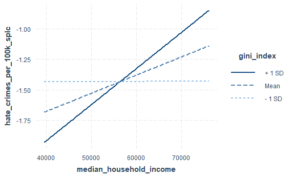
There appears to be a significant interaction between urbanization and
percent\_pop with high school degree.

Check 3\_way interactions between predictors of interest

``` r
fit_4 = lm(hate_crimes_per_100k_splc ~ perc_population_with_high_school_degree *unemployment* gini_index, data = crime_trans)
summary(fit_4)
```

    ## 
    ## Call:
    ## lm(formula = hate_crimes_per_100k_splc ~ perc_population_with_high_school_degree * 
    ##     unemployment * gini_index, data = crime_trans)
    ## 
    ## Residuals:
    ##      Min       1Q   Median       3Q      Max 
    ## -1.05139 -0.36654  0.06147  0.32696  1.07430 
    ## 
    ## Coefficients:
    ##                                                                    Estimate
    ## (Intercept)                                                           74.19
    ## perc_population_with_high_school_degree                              -85.87
    ## unemploymentlow                                                      -83.30
    ## gini_index                                                          -174.12
    ## perc_population_with_high_school_degree:unemploymentlow               84.89
    ## perc_population_with_high_school_degree:gini_index                   197.60
    ## unemploymentlow:gini_index                                           173.39
    ## perc_population_with_high_school_degree:unemploymentlow:gini_index  -174.76
    ##                                                                    Std. Error
    ## (Intercept)                                                            109.72
    ## perc_population_with_high_school_degree                                124.18
    ## unemploymentlow                                                        148.62
    ## gini_index                                                             238.43
    ## perc_population_with_high_school_degree:unemploymentlow                168.30
    ## perc_population_with_high_school_degree:gini_index                     270.19
    ## unemploymentlow:gini_index                                             323.43
    ## perc_population_with_high_school_degree:unemploymentlow:gini_index     366.82
    ##                                                                    t value
    ## (Intercept)                                                          0.676
    ## perc_population_with_high_school_degree                             -0.691
    ## unemploymentlow                                                     -0.560
    ## gini_index                                                          -0.730
    ## perc_population_with_high_school_degree:unemploymentlow              0.504
    ## perc_population_with_high_school_degree:gini_index                   0.731
    ## unemploymentlow:gini_index                                           0.536
    ## perc_population_with_high_school_degree:unemploymentlow:gini_index  -0.476
    ##                                                                    Pr(>|t|)
    ## (Intercept)                                                           0.503
    ## perc_population_with_high_school_degree                               0.494
    ## unemploymentlow                                                       0.579
    ## gini_index                                                            0.470
    ## perc_population_with_high_school_degree:unemploymentlow               0.617
    ## perc_population_with_high_school_degree:gini_index                    0.469
    ## unemploymentlow:gini_index                                            0.595
    ## perc_population_with_high_school_degree:unemploymentlow:gini_index    0.637
    ## 
    ## Residual standard error: 0.5287 on 35 degrees of freedom
    ## Multiple R-squared:  0.2699, Adjusted R-squared:  0.1239 
    ## F-statistic: 1.848 on 7 and 35 DF,  p-value: 0.1087

``` r
probe_interaction(fit_4, pred = perc_population_with_high_school_degree, modx = unemployment, mod2 = gini_index, alpha = .1)
```

    ## Warning: Johnson-Neyman intervals are not available for factor moderators.

    ## ¦¦¦¦¦¦¦¦¦¦¦¦¦¦¦ While gini_index (2nd moderator) = 0.44 (- 1 SD) ¦¦¦¦¦¦¦¦¦¦¦¦¦¦¦ 
    ## 
    ## SIMPLE SLOPES ANALYSIS 
    ## 
    ## Slope of perc_population_with_high_school_degree when unemployment = high: 
    ## 
    ##   Est.   S.E.   t val.      p
    ## ------ ------ -------- ------
    ##   0.34   7.81     0.04   0.97
    ## 
    ## Slope of perc_population_with_high_school_degree when unemployment = low: 
    ## 
    ##   Est.   S.E.   t val.      p
    ## ------ ------ -------- ------
    ##   8.98   7.26     1.24   0.22
    ## 
    ## ¦¦¦¦¦¦¦¦¦¦¦¦¦¦¦¦ While gini_index (2nd moderator) = 0.45 (Mean) ¦¦¦¦¦¦¦¦¦¦¦¦¦¦¦¦ 
    ## 
    ## SIMPLE SLOPES ANALYSIS 
    ## 
    ## Slope of perc_population_with_high_school_degree when unemployment = high: 
    ## 
    ##   Est.   S.E.   t val.      p
    ## ------ ------ -------- ------
    ##   3.85   4.95     0.78   0.44
    ## 
    ## Slope of perc_population_with_high_school_degree when unemployment = low: 
    ## 
    ##   Est.   S.E.   t val.      p
    ## ------ ------ -------- ------
    ##   9.39   5.10     1.84   0.07
    ## 
    ## ¦¦¦¦¦¦¦¦¦¦¦¦¦¦¦ While gini_index (2nd moderator) = 0.47 (+ 1 SD) ¦¦¦¦¦¦¦¦¦¦¦¦¦¦¦ 
    ## 
    ## SIMPLE SLOPES ANALYSIS 
    ## 
    ## Slope of perc_population_with_high_school_degree when unemployment = high: 
    ## 
    ##   Est.   S.E.   t val.      p
    ## ------ ------ -------- ------
    ##   7.36   5.83     1.26   0.22
    ## 
    ## Slope of perc_population_with_high_school_degree when unemployment = low: 
    ## 
    ##   Est.   S.E.   t val.      p
    ## ------ ------ -------- ------
    ##   9.80   6.18     1.59   0.12

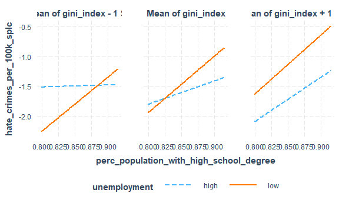

Conclusion: There are no significant interactions between our predictors
of interest

``` r
# compare models
main = lm(hate_crimes_per_100k_splc~gini_index, data = crime_trans) ## Model with main predictor
broom::glance(main)
```

    ## # A tibble: 1 x 12
    ##   r.squared adj.r.squared sigma statistic p.value    df logLik   AIC   BIC
    ##       <dbl>         <dbl> <dbl>     <dbl>   <dbl> <dbl>  <dbl> <dbl> <dbl>
    ## 1  0.000257       -0.0241 0.572    0.0106   0.919     1  -35.9  77.9  83.2
    ## # ... with 3 more variables: deviance <dbl>, df.residual <int>, nobs <int>

``` r
final = lm(formula = hate_crimes_per_100k_splc ~ unemployment + perc_population_with_high_school_degree + gini_index, data = int_3)
broom::glance(final)
```

    ## # A tibble: 1 x 12
    ##   r.squared adj.r.squared sigma statistic p.value    df logLik   AIC   BIC
    ##       <dbl>         <dbl> <dbl>     <dbl>   <dbl> <dbl>  <dbl> <dbl> <dbl>
    ## 1     0.364         0.258 0.504      3.43  0.0392     3  -13.9  37.9  43.3
    ## # ... with 3 more variables: deviance <dbl>, df.residual <int>, nobs <int>

``` r
broom::tidy(final)
```

    ## # A tibble: 4 x 5
    ##   term                                    estimate std.error statistic p.value
    ##   <chr>                                      <dbl>     <dbl>     <dbl>   <dbl>
    ## 1 (Intercept)                              -12.7       5.87      -2.16  0.0446
    ## 2 unemploymentlow                            0.466     0.232      2.01  0.0601
    ## 3 perc_population_with_high_school_degree    8.20      4.28       1.92  0.0714
    ## 4 gini_index                                 8.65      7.21       1.20  0.246

``` r
final_rec
```

    ## 
    ## Call:
    ## lm(formula = hate_crimes_per_100k_splc ~ unemployment + perc_population_with_high_school_degree + 
    ##     gini_index, data = crime_trans)
    ## 
    ## Coefficients:
    ##                             (Intercept)  
    ##                                -12.8782  
    ##                         unemploymentlow  
    ##                                  0.3223  
    ## perc_population_with_high_school_degree  
    ##                                  6.8299  
    ##                              gini_index  
    ##                                 11.6847

``` r
broom::glance(final_rec) # our final recommended model
```

    ## # A tibble: 1 x 12
    ##   r.squared adj.r.squared sigma statistic p.value    df logLik   AIC   BIC
    ##       <dbl>         <dbl> <dbl>     <dbl>   <dbl> <dbl>  <dbl> <dbl> <dbl>
    ## 1     0.211         0.150 0.521      3.47  0.0251     3  -30.9  71.7  80.5
    ## # ... with 3 more variables: deviance <dbl>, df.residual <int>, nobs <int>

## everything below can be deleted

stepwise with all two-way interactions for full transformed data.

``` r
trans_full_df = 
  crime_df %>% 
  mutate(
    hate_crimes_per_100k_splc = log(hate_crimes_per_100k_splc)
  )
```

``` r
mod_trans_2way = lm(hate_crimes_per_100k_splc ~ (unemployment + perc_population_with_high_school_degree + gini_index)^2, data = trans_full_df)
step(mod_trans_2way, direction='backward')
```

    ## Start:  AIC=-44.33
    ## hate_crimes_per_100k_splc ~ (unemployment + perc_population_with_high_school_degree + 
    ##     gini_index)^2
    ## 
    ##                                                        Df Sum of Sq    RSS
    ## - unemployment:gini_index                               1  0.021346 13.607
    ## - unemployment:perc_population_with_high_school_degree  1  0.077866 13.663
    ## - perc_population_with_high_school_degree:gini_index    1  0.084496 13.670
    ## <none>                                                              13.585
    ##                                                            AIC
    ## - unemployment:gini_index                              -46.260
    ## - unemployment:perc_population_with_high_school_degree -46.065
    ## - perc_population_with_high_school_degree:gini_index   -46.042
    ## <none>                                                 -44.334
    ## 
    ## Step:  AIC=-46.26
    ## hate_crimes_per_100k_splc ~ unemployment + perc_population_with_high_school_degree + 
    ##     gini_index + unemployment:perc_population_with_high_school_degree + 
    ##     perc_population_with_high_school_degree:gini_index
    ## 
    ##                                                        Df Sum of Sq    RSS
    ## - perc_population_with_high_school_degree:gini_index    1  0.089693 13.697
    ## - unemployment:perc_population_with_high_school_degree  1  0.166168 13.773
    ## <none>                                                              13.607
    ##                                                            AIC
    ## - perc_population_with_high_school_degree:gini_index   -47.951
    ## - unemployment:perc_population_with_high_school_degree -47.690
    ## <none>                                                 -46.260
    ## 
    ## Step:  AIC=-47.95
    ## hate_crimes_per_100k_splc ~ unemployment + perc_population_with_high_school_degree + 
    ##     gini_index + unemployment:perc_population_with_high_school_degree
    ## 
    ##                                                        Df Sum of Sq    RSS
    ## - unemployment:perc_population_with_high_school_degree  1    0.1933 13.890
    ## <none>                                                              13.697
    ## - gini_index                                            1    3.5744 17.271
    ##                                                            AIC
    ## - unemployment:perc_population_with_high_school_degree -49.293
    ## <none>                                                 -47.951
    ## - gini_index                                           -39.053
    ## 
    ## Step:  AIC=-49.29
    ## hate_crimes_per_100k_splc ~ unemployment + perc_population_with_high_school_degree + 
    ##     gini_index
    ## 
    ##                                           Df Sum of Sq    RSS     AIC
    ## - unemployment                             1    0.4708 14.361 -49.726
    ## <none>                                                 13.890 -49.293
    ## - gini_index                               1    4.1986 18.088 -38.879
    ## - perc_population_with_high_school_degree  1    4.5289 18.419 -38.029
    ## 
    ## Step:  AIC=-49.73
    ## hate_crimes_per_100k_splc ~ perc_population_with_high_school_degree + 
    ##     gini_index
    ## 
    ##                                           Df Sum of Sq    RSS     AIC
    ## <none>                                                 14.361 -49.726
    ## - gini_index                               1    3.7838 18.144 -40.734
    ## - perc_population_with_high_school_degree  1    6.2090 20.570 -34.838

    ## 
    ## Call:
    ## lm(formula = hate_crimes_per_100k_splc ~ perc_population_with_high_school_degree + 
    ##     gini_index, data = trans_full_df)
    ## 
    ## Coefficients:
    ##                             (Intercept)  
    ##                                  -20.28  
    ## perc_population_with_high_school_degree  
    ##                                   13.05  
    ##                              gini_index  
    ##                                   16.56

stepwise with all three-way interactions for full transformed data.

``` r
mod_trans_3way = lm(hate_crimes_per_100k_splc ~ (unemployment + perc_population_with_high_school_degree + gini_index)^3, data = trans_full_df)
step(mod_trans_3way, direction='backward')
```

    ## Start:  AIC=-42.59
    ## hate_crimes_per_100k_splc ~ (unemployment + perc_population_with_high_school_degree + 
    ##     gini_index)^3
    ## 
    ##                                                                   Df Sum of Sq
    ## - unemployment:perc_population_with_high_school_degree:gini_index  1  0.073456
    ## <none>                                                                        
    ##                                                                      RSS
    ## - unemployment:perc_population_with_high_school_degree:gini_index 13.585
    ## <none>                                                            13.512
    ##                                                                       AIC
    ## - unemployment:perc_population_with_high_school_degree:gini_index -44.334
    ## <none>                                                            -42.589
    ## 
    ## Step:  AIC=-44.33
    ## hate_crimes_per_100k_splc ~ unemployment + perc_population_with_high_school_degree + 
    ##     gini_index + unemployment:perc_population_with_high_school_degree + 
    ##     unemployment:gini_index + perc_population_with_high_school_degree:gini_index
    ## 
    ##                                                        Df Sum of Sq    RSS
    ## - unemployment:gini_index                               1  0.021346 13.607
    ## - unemployment:perc_population_with_high_school_degree  1  0.077866 13.663
    ## - perc_population_with_high_school_degree:gini_index    1  0.084496 13.670
    ## <none>                                                              13.585
    ##                                                            AIC
    ## - unemployment:gini_index                              -46.260
    ## - unemployment:perc_population_with_high_school_degree -46.065
    ## - perc_population_with_high_school_degree:gini_index   -46.042
    ## <none>                                                 -44.334
    ## 
    ## Step:  AIC=-46.26
    ## hate_crimes_per_100k_splc ~ unemployment + perc_population_with_high_school_degree + 
    ##     gini_index + unemployment:perc_population_with_high_school_degree + 
    ##     perc_population_with_high_school_degree:gini_index
    ## 
    ##                                                        Df Sum of Sq    RSS
    ## - perc_population_with_high_school_degree:gini_index    1  0.089693 13.697
    ## - unemployment:perc_population_with_high_school_degree  1  0.166168 13.773
    ## <none>                                                              13.607
    ##                                                            AIC
    ## - perc_population_with_high_school_degree:gini_index   -47.951
    ## - unemployment:perc_population_with_high_school_degree -47.690
    ## <none>                                                 -46.260
    ## 
    ## Step:  AIC=-47.95
    ## hate_crimes_per_100k_splc ~ unemployment + perc_population_with_high_school_degree + 
    ##     gini_index + unemployment:perc_population_with_high_school_degree
    ## 
    ##                                                        Df Sum of Sq    RSS
    ## - unemployment:perc_population_with_high_school_degree  1    0.1933 13.890
    ## <none>                                                              13.697
    ## - gini_index                                            1    3.5744 17.271
    ##                                                            AIC
    ## - unemployment:perc_population_with_high_school_degree -49.293
    ## <none>                                                 -47.951
    ## - gini_index                                           -39.053
    ## 
    ## Step:  AIC=-49.29
    ## hate_crimes_per_100k_splc ~ unemployment + perc_population_with_high_school_degree + 
    ##     gini_index
    ## 
    ##                                           Df Sum of Sq    RSS     AIC
    ## - unemployment                             1    0.4708 14.361 -49.726
    ## <none>                                                 13.890 -49.293
    ## - gini_index                               1    4.1986 18.088 -38.879
    ## - perc_population_with_high_school_degree  1    4.5289 18.419 -38.029
    ## 
    ## Step:  AIC=-49.73
    ## hate_crimes_per_100k_splc ~ perc_population_with_high_school_degree + 
    ##     gini_index
    ## 
    ##                                           Df Sum of Sq    RSS     AIC
    ## <none>                                                 14.361 -49.726
    ## - gini_index                               1    3.7838 18.144 -40.734
    ## - perc_population_with_high_school_degree  1    6.2090 20.570 -34.838

    ## 
    ## Call:
    ## lm(formula = hate_crimes_per_100k_splc ~ perc_population_with_high_school_degree + 
    ##     gini_index, data = trans_full_df)
    ## 
    ## Coefficients:
    ##                             (Intercept)  
    ##                                  -20.28  
    ## perc_population_with_high_school_degree  
    ##                                   13.05  
    ##                              gini_index  
    ##                                   16.56

stepwise with all two-way interactions for full non-transformed data.

``` r
mod_2way = lm(hate_crimes_per_100k_splc ~ (unemployment + perc_population_with_high_school_degree + gini_index)^2, data = crime_df)
step(mod_2way, direction='backward')
```

    ## Start:  AIC=-146.21
    ## hate_crimes_per_100k_splc ~ (unemployment + perc_population_with_high_school_degree + 
    ##     gini_index)^2
    ## 
    ##                                                        Df Sum of Sq    RSS
    ## - perc_population_with_high_school_degree:gini_index    1  0.000100 1.5551
    ## - unemployment:perc_population_with_high_school_degree  1  0.027886 1.5829
    ## - unemployment:gini_index                               1  0.049893 1.6049
    ## <none>                                                              1.5550
    ##                                                            AIC
    ## - perc_population_with_high_school_degree:gini_index   -148.21
    ## - unemployment:perc_population_with_high_school_degree -147.37
    ## - unemployment:gini_index                              -146.72
    ## <none>                                                 -146.21
    ## 
    ## Step:  AIC=-148.21
    ## hate_crimes_per_100k_splc ~ unemployment + perc_population_with_high_school_degree + 
    ##     gini_index + unemployment:perc_population_with_high_school_degree + 
    ##     unemployment:gini_index
    ## 
    ##                                                        Df Sum of Sq    RSS
    ## - unemployment:perc_population_with_high_school_degree  1  0.028171 1.5832
    ## - unemployment:gini_index                               1  0.049800 1.6049
    ## <none>                                                              1.5551
    ##                                                            AIC
    ## - unemployment:perc_population_with_high_school_degree -149.36
    ## - unemployment:gini_index                              -148.72
    ## <none>                                                 -148.21
    ## 
    ## Step:  AIC=-149.36
    ## hate_crimes_per_100k_splc ~ unemployment + perc_population_with_high_school_degree + 
    ##     gini_index + unemployment:gini_index
    ## 
    ##                                           Df Sum of Sq    RSS     AIC
    ## - unemployment:gini_index                  1   0.02565 1.6089 -150.61
    ## <none>                                                 1.5832 -149.36
    ## - perc_population_with_high_school_degree  1   0.72273 2.3060 -133.69
    ## 
    ## Step:  AIC=-150.61
    ## hate_crimes_per_100k_splc ~ unemployment + perc_population_with_high_school_degree + 
    ##     gini_index
    ## 
    ##                                           Df Sum of Sq    RSS     AIC
    ## - unemployment                             1   0.00353 1.6124 -152.50
    ## <none>                                                 1.6089 -150.61
    ## - perc_population_with_high_school_degree  1   0.86123 2.4701 -132.46
    ## - gini_index                               1   1.01969 2.6286 -129.53
    ## 
    ## Step:  AIC=-152.5
    ## hate_crimes_per_100k_splc ~ perc_population_with_high_school_degree + 
    ##     gini_index
    ## 
    ##                                           Df Sum of Sq    RSS     AIC
    ## <none>                                                 1.6124 -152.50
    ## - perc_population_with_high_school_degree  1    1.0064 2.6188 -131.71
    ## - gini_index                               1    1.0448 2.6572 -131.02

    ## 
    ## Call:
    ## lm(formula = hate_crimes_per_100k_splc ~ perc_population_with_high_school_degree + 
    ##     gini_index, data = crime_df)
    ## 
    ## Coefficients:
    ##                             (Intercept)  
    ##                                  -8.212  
    ## perc_population_with_high_school_degree  
    ##                                   5.256  
    ##                              gini_index  
    ##                                   8.702

stepwise with all three-way interactions for full non-transformed data.

``` r
mod_3way = lm(hate_crimes_per_100k_splc ~ (unemployment + perc_population_with_high_school_degree + gini_index)^3, data = crime_df)
step(mod_3way, direction='backward')
```

    ## Start:  AIC=-144.21
    ## hate_crimes_per_100k_splc ~ (unemployment + perc_population_with_high_school_degree + 
    ##     gini_index)^3
    ## 
    ##                                                                   Df  Sum of Sq
    ## - unemployment:perc_population_with_high_school_degree:gini_index  1 7.7861e-05
    ## <none>                                                                         
    ##                                                                      RSS
    ## - unemployment:perc_population_with_high_school_degree:gini_index 1.5550
    ## <none>                                                            1.5549
    ##                                                                       AIC
    ## - unemployment:perc_population_with_high_school_degree:gini_index -146.21
    ## <none>                                                            -144.21
    ## 
    ## Step:  AIC=-146.21
    ## hate_crimes_per_100k_splc ~ unemployment + perc_population_with_high_school_degree + 
    ##     gini_index + unemployment:perc_population_with_high_school_degree + 
    ##     unemployment:gini_index + perc_population_with_high_school_degree:gini_index
    ## 
    ##                                                        Df Sum of Sq    RSS
    ## - perc_population_with_high_school_degree:gini_index    1  0.000100 1.5551
    ## - unemployment:perc_population_with_high_school_degree  1  0.027886 1.5829
    ## - unemployment:gini_index                               1  0.049893 1.6049
    ## <none>                                                              1.5550
    ##                                                            AIC
    ## - perc_population_with_high_school_degree:gini_index   -148.21
    ## - unemployment:perc_population_with_high_school_degree -147.37
    ## - unemployment:gini_index                              -146.72
    ## <none>                                                 -146.21
    ## 
    ## Step:  AIC=-148.21
    ## hate_crimes_per_100k_splc ~ unemployment + perc_population_with_high_school_degree + 
    ##     gini_index + unemployment:perc_population_with_high_school_degree + 
    ##     unemployment:gini_index
    ## 
    ##                                                        Df Sum of Sq    RSS
    ## - unemployment:perc_population_with_high_school_degree  1  0.028171 1.5832
    ## - unemployment:gini_index                               1  0.049800 1.6049
    ## <none>                                                              1.5551
    ##                                                            AIC
    ## - unemployment:perc_population_with_high_school_degree -149.36
    ## - unemployment:gini_index                              -148.72
    ## <none>                                                 -148.21
    ## 
    ## Step:  AIC=-149.36
    ## hate_crimes_per_100k_splc ~ unemployment + perc_population_with_high_school_degree + 
    ##     gini_index + unemployment:gini_index
    ## 
    ##                                           Df Sum of Sq    RSS     AIC
    ## - unemployment:gini_index                  1   0.02565 1.6089 -150.61
    ## <none>                                                 1.5832 -149.36
    ## - perc_population_with_high_school_degree  1   0.72273 2.3060 -133.69
    ## 
    ## Step:  AIC=-150.61
    ## hate_crimes_per_100k_splc ~ unemployment + perc_population_with_high_school_degree + 
    ##     gini_index
    ## 
    ##                                           Df Sum of Sq    RSS     AIC
    ## - unemployment                             1   0.00353 1.6124 -152.50
    ## <none>                                                 1.6089 -150.61
    ## - perc_population_with_high_school_degree  1   0.86123 2.4701 -132.46
    ## - gini_index                               1   1.01969 2.6286 -129.53
    ## 
    ## Step:  AIC=-152.5
    ## hate_crimes_per_100k_splc ~ perc_population_with_high_school_degree + 
    ##     gini_index
    ## 
    ##                                           Df Sum of Sq    RSS     AIC
    ## <none>                                                 1.6124 -152.50
    ## - perc_population_with_high_school_degree  1    1.0064 2.6188 -131.71
    ## - gini_index                               1    1.0448 2.6572 -131.02

    ## 
    ## Call:
    ## lm(formula = hate_crimes_per_100k_splc ~ perc_population_with_high_school_degree + 
    ##     gini_index, data = crime_df)
    ## 
    ## Coefficients:
    ##                             (Intercept)  
    ##                                  -8.212  
    ## perc_population_with_high_school_degree  
    ##                                   5.256  
    ##                              gini_index  
    ##                                   8.702

### Model Diagnosis:

Use diagnostic plots to check model assumptions:

``` r
plot(final_rec)
```

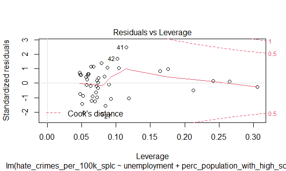
1. Residuals vs. Fitted Plot: The points show a random patter and are
evenly spread above and below the line of 0. The red line is
approximately horizontal and is bouncing around the line of 0. This
graph shows that this model fit the assumption of homoscedasiticity.

2.  Normal Q-Q Plot: All points align in an approximately straight line
    with no significant departure. This graph indicates that the
    residuals are normal.

3.  Scale-Location Plot: Similar with the residual vs. fitted plot,
    points in the graph are randomly and equally spread. The red line is
    approximately horizontal indicating that the variance of the model
    is equal.

4.  Residuals vs. Leverage Plot: Although there is a bounce in the line,
    the overall line is approximately horizontal around the 0. Points
    are not randomly spread and are lump together between 0.05 and 0.10.
    There is no point beyond the Cook’s distance so we could assume that
    there is no significant influential point.

Overall, these four graphs show that this fitted model is good for
represent the data.

Check for outlier:

``` r
stu_res <- rstandard(final_rec)
outliers_y <- stu_res[abs(stu_res)>2.5]
outliers_y
```

    ## named numeric(0)

Result: there is no outlier in Y.

Check for multicollinearity:

``` r
vif(final_rec)
```

    ##                         unemploymentlow perc_population_with_high_school_degree 
    ##                                1.335118                                1.970627 
    ##                              gini_index 
    ##                                1.806199

Result: None of the parameter has variance inflation factor (VIF) value
greater than 5 indicating that there is no multicollinearity in this
model.
