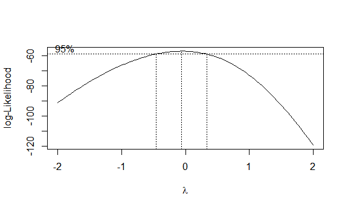
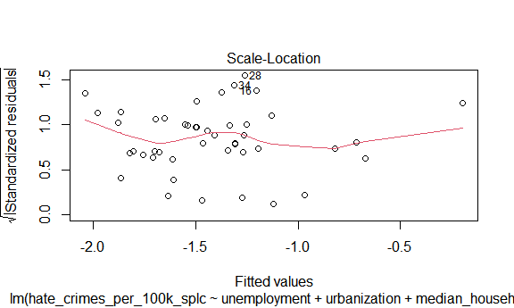
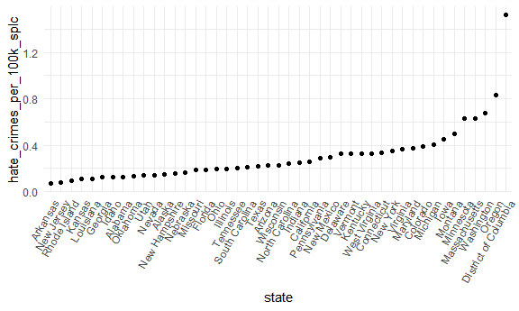

Data Exploration
================
Hanfei Qi, Anmol Singh, Wuraola Olawole, Ting Lian
12/4/2020

### Data Exploration:

Read data and make sure factors are factors.

``` r
crime_df = 
  read_csv("data/HateCrimes.csv") %>% 
  mutate(
    unemployment = factor(unemployment),
    urbanization = factor(urbanization),
    hate_crimes_per_100k_splc = as.numeric(hate_crimes_per_100k_splc)
  )
```

Descriptive statistics

``` r
my_controls =  tableby.control(
               total = F,
               test=F,  
               numeric.stats = c("meansd", "medianq1q3", "range", "Nmiss2"),
               cat.stats = c("countpct", "Nmiss2"),
               stats.labels = list(
               meansd = "Mean (SD)",
               medianq1q3 = "Median (Q1, Q3)",
               range = "Min - Max",
               Nmiss2 = "Missing",
               countpct = "N (%)"))

tab = tableby( ~ hate_crimes_per_100k_splc + unemployment + urbanization + median_household_income +   perc_population_with_high_school_degree + perc_non_citizen + gini_index + perc_non_white, 
               data = crime_df, 
               control = my_controls)

summary(tab, title = "Descriptive Statistics: Hate Crime Data", text = T)
```

    ## 
    ## Table: Descriptive Statistics: Hate Crime Data
    ## 
    ## |                                        |          Overall (N=51)          |
    ## |:---------------------------------------|:--------------------------------:|
    ## |hate_crimes_per_100k_splc               |                                  |
    ## |-  Mean (SD)                            |          0.304 (0.253)           |
    ## |-  Median (Q1, Q3)                      |       0.226 (0.143, 0.357)       |
    ## |-  Min - Max                            |          0.067 - 1.522           |
    ## |-  Missing                              |                4                 |
    ## |unemployment                            |                                  |
    ## |-  high                                 |            24 (47.1%)            |
    ## |-  low                                  |            27 (52.9%)            |
    ## |-  Missing                              |                0                 |
    ## |urbanization                            |                                  |
    ## |-  high                                 |            24 (47.1%)            |
    ## |-  low                                  |            27 (52.9%)            |
    ## |-  Missing                              |                0                 |
    ## |median_household_income                 |                                  |
    ## |-  Mean (SD)                            |       55223.608 (9208.478)       |
    ## |-  Median (Q1, Q3)                      | 54916.000 (48657.000, 60719.000) |
    ## |-  Min - Max                            |      35521.000 - 76165.000       |
    ## |-  Missing                              |                0                 |
    ## |perc_population_with_high_school_degree |                                  |
    ## |-  Mean (SD)                            |          0.869 (0.034)           |
    ## |-  Median (Q1, Q3)                      |       0.874 (0.841, 0.898)       |
    ## |-  Min - Max                            |          0.799 - 0.918           |
    ## |-  Missing                              |                0                 |
    ## |perc_non_citizen                        |                                  |
    ## |-  Mean (SD)                            |          0.055 (0.031)           |
    ## |-  Median (Q1, Q3)                      |       0.045 (0.030, 0.080)       |
    ## |-  Min - Max                            |          0.010 - 0.130           |
    ## |-  Missing                              |                3                 |
    ## |gini_index                              |                                  |
    ## |-  Mean (SD)                            |          0.454 (0.021)           |
    ## |-  Median (Q1, Q3)                      |       0.454 (0.440, 0.467)       |
    ## |-  Min - Max                            |          0.419 - 0.532           |
    ## |-  Missing                              |                0                 |
    ## |perc_non_white                          |                                  |
    ## |-  Mean (SD)                            |          0.316 (0.165)           |
    ## |-  Median (Q1, Q3)                      |       0.280 (0.195, 0.420)       |
    ## |-  Min - Max                            |          0.060 - 0.810           |
    ## |-  Missing                              |                0                 |

Comment: there are 4 NA’s in variable `hate_crimes_per_100k_splc` and 3
NA’s in variable `perc_non_citizen`.

Code to remove NA’s (not sure if we wanna do that).

``` r
crime_df_no_na = 
  read_csv("data/HateCrimes.csv", na = c("", "N/A")) %>% 
  mutate(
    unemployment = factor(unemployment),
    urbanization = factor(urbanization),
    hate_crimes_per_100k_splc = as.numeric(hate_crimes_per_100k_splc)
  ) %>% 
  na.omit()
```

Distribution of the outcome

``` r
crime_df_no_na %>% 
  ggplot(aes(x = hate_crimes_per_100k_splc)) + geom_density()
```


Comment: we need transformation

``` r
mod = 
  lm(hate_crimes_per_100k_splc ~ unemployment + urbanization + median_household_income +   perc_population_with_high_school_degree + perc_non_citizen + gini_index + perc_non_white, 
      data = crime_df)

boxcox(mod)
```



Perform the tranformation.

``` r
trans_df = 
  crime_df_no_na %>% 
  mutate(
    hate_crimes_per_100k_splc = log(hate_crimes_per_100k_splc)
  )

trans_df %>% 
  ggplot(aes(x = hate_crimes_per_100k_splc)) + geom_density()
```


Looks good\!

Plots before and after transformation.

``` r
plot(mod)
```


``` r
mod_trans = lm(hate_crimes_per_100k_splc ~ unemployment + urbanization + median_household_income +   perc_population_with_high_school_degree + perc_non_citizen + gini_index + perc_non_white, 
      data = trans_df)

plot(mod_trans)
```



Plot crime rate by states.

``` r
crime_df_no_na %>% 
  mutate(state = fct_reorder(state, hate_crimes_per_100k_splc)) %>% 
  ggplot(aes(x = state, y = hate_crimes_per_100k_splc)) + 
  geom_point() + 
  geom_line() +
  theme(axis.text.x = element_text(angle = 60, hjust = 1))
```

    ## geom_path: Each group consists of only one observation. Do you need to adjust
    ## the group aesthetic?



Comment: A wired point in `District of Columbia`. The rate of `Oregon`
is slightly higher than other states. I will also consider `Minnesota`,
`Massachusetts`, `Washington` as potential outliers.

### Modeling:

**Test if association between income inequality and hate crimes holds
true:**

``` r
income_hate_model_full_data = crime_df%>%
  lm(hate_crimes_per_100k_splc~gini_index,data=.)

income_hate_model_full_data%>%
  broom::tidy()%>%
  knitr::kable(caption = "Testing Association between Income Inequality and Hate Crime using all the data", format = "html")
```

<table>

<caption>

Testing Association between Income Inequality and Hate Crime using all
the data

</caption>

<thead>

<tr>

<th style="text-align:left;">

term

</th>

<th style="text-align:right;">

estimate

</th>

<th style="text-align:right;">

std.error

</th>

<th style="text-align:right;">

statistic

</th>

<th style="text-align:right;">

p.value

</th>

</tr>

</thead>

<tbody>

<tr>

<td style="text-align:left;">

(Intercept)

</td>

<td style="text-align:right;">

\-1.527463

</td>

<td style="text-align:right;">

0.7833043

</td>

<td style="text-align:right;">

\-1.950025

</td>

<td style="text-align:right;">

0.0574197

</td>

</tr>

<tr>

<td style="text-align:left;">

gini\_index

</td>

<td style="text-align:right;">

4.020510

</td>

<td style="text-align:right;">

1.7177215

</td>

<td style="text-align:right;">

2.340606

</td>

<td style="text-align:right;">

0.0237445

</td>

</tr>

</tbody>

</table>

``` r
income_hate_model_no_NA = trans_df%>%
  lm(hate_crimes_per_100k_splc~gini_index,data=.)

income_hate_model_no_NA%>%
  broom::tidy()%>%
  knitr::kable(caption = "Testing Association between Income Inequality and Hate Crime using data excluding NA's", format = "html")
```

<table>

<caption>

Testing Association between Income Inequality and Hate Crime using data
excluding NA’s

</caption>

<thead>

<tr>

<th style="text-align:left;">

term

</th>

<th style="text-align:right;">

estimate

</th>

<th style="text-align:right;">

std.error

</th>

<th style="text-align:right;">

statistic

</th>

<th style="text-align:right;">

p.value

</th>

</tr>

</thead>

<tbody>

<tr>

<td style="text-align:left;">

(Intercept)

</td>

<td style="text-align:right;">

\-4.515451

</td>

<td style="text-align:right;">

2.108654

</td>

<td style="text-align:right;">

\-2.141390

</td>

<td style="text-align:right;">

0.0379511

</td>

</tr>

<tr>

<td style="text-align:left;">

gini\_index

</td>

<td style="text-align:right;">

6.789006

</td>

<td style="text-align:right;">

4.622645

</td>

<td style="text-align:right;">

1.468641

</td>

<td style="text-align:right;">

0.1492083

</td>

</tr>

</tbody>

</table>

p-value is only significant for data which includes NA’s.

**Correlation Matrix of All Variables:**

``` r
corr_matrix = trans_df%>%
  mutate(unemployment = ifelse(unemployment=="high",1,0),
         urbanization = ifelse(urbanization=="high",1,0))%>%
  dplyr::select(-state)%>%
         cor()%>%
  data.frame()

corr_matrix%>%
  knitr::kable(caption = "Correlation Matrix for all variables except for State in Data Set", format = "html")
```

<table>

<caption>

Correlation Matrix for all variables except for State in Data Set

</caption>

<thead>

<tr>

<th style="text-align:left;">

</th>

<th style="text-align:right;">

unemployment

</th>

<th style="text-align:right;">

urbanization

</th>

<th style="text-align:right;">

median\_household\_income

</th>

<th style="text-align:right;">

perc\_population\_with\_high\_school\_degree

</th>

<th style="text-align:right;">

perc\_non\_citizen

</th>

<th style="text-align:right;">

gini\_index

</th>

<th style="text-align:right;">

perc\_non\_white

</th>

<th style="text-align:right;">

hate\_crimes\_per\_100k\_splc

</th>

</tr>

</thead>

<tbody>

<tr>

<td style="text-align:left;">

unemployment

</td>

<td style="text-align:right;">

1.0000000

</td>

<td style="text-align:right;">

0.2435648

</td>

<td style="text-align:right;">

\-0.2538367

</td>

<td style="text-align:right;">

\-0.4526394

</td>

<td style="text-align:right;">

0.2408705

</td>

<td style="text-align:right;">

0.4089989

</td>

<td style="text-align:right;">

0.4281971

</td>

<td style="text-align:right;">

\-0.1680668

</td>

</tr>

<tr>

<td style="text-align:left;">

urbanization

</td>

<td style="text-align:right;">

0.2435648

</td>

<td style="text-align:right;">

1.0000000

</td>

<td style="text-align:right;">

0.2613532

</td>

<td style="text-align:right;">

\-0.1591792

</td>

<td style="text-align:right;">

0.6807743

</td>

<td style="text-align:right;">

0.4298763

</td>

<td style="text-align:right;">

0.5085536

</td>

<td style="text-align:right;">

0.1837247

</td>

</tr>

<tr>

<td style="text-align:left;">

median\_household\_income

</td>

<td style="text-align:right;">

\-0.2538367

</td>

<td style="text-align:right;">

0.2613532

</td>

<td style="text-align:right;">

1.0000000

</td>

<td style="text-align:right;">

0.6511383

</td>

<td style="text-align:right;">

0.3017394

</td>

<td style="text-align:right;">

\-0.1295216

</td>

<td style="text-align:right;">

0.0390540

</td>

<td style="text-align:right;">

0.3109375

</td>

</tr>

<tr>

<td style="text-align:left;">

perc\_population\_with\_high\_school\_degree

</td>

<td style="text-align:right;">

\-0.4526394

</td>

<td style="text-align:right;">

\-0.1591792

</td>

<td style="text-align:right;">

0.6511383

</td>

<td style="text-align:right;">

1.0000000

</td>

<td style="text-align:right;">

\-0.2621288

</td>

<td style="text-align:right;">

\-0.5371591

</td>

<td style="text-align:right;">

\-0.4958932

</td>

<td style="text-align:right;">

0.2960528

</td>

</tr>

<tr>

<td style="text-align:left;">

perc\_non\_citizen

</td>

<td style="text-align:right;">

0.2408705

</td>

<td style="text-align:right;">

0.6807743

</td>

<td style="text-align:right;">

0.3017394

</td>

<td style="text-align:right;">

\-0.2621288

</td>

<td style="text-align:right;">

1.0000000

</td>

<td style="text-align:right;">

0.4798976

</td>

<td style="text-align:right;">

0.7526102

</td>

<td style="text-align:right;">

0.1369321

</td>

</tr>

<tr>

<td style="text-align:left;">

gini\_index

</td>

<td style="text-align:right;">

0.4089989

</td>

<td style="text-align:right;">

0.4298763

</td>

<td style="text-align:right;">

\-0.1295216

</td>

<td style="text-align:right;">

\-0.5371591

</td>

<td style="text-align:right;">

0.4798976

</td>

<td style="text-align:right;">

1.0000000

</td>

<td style="text-align:right;">

0.5484035

</td>

<td style="text-align:right;">

0.2185514

</td>

</tr>

<tr>

<td style="text-align:left;">

perc\_non\_white

</td>

<td style="text-align:right;">

0.4281971

</td>

<td style="text-align:right;">

0.5085536

</td>

<td style="text-align:right;">

0.0390540

</td>

<td style="text-align:right;">

\-0.4958932

</td>

<td style="text-align:right;">

0.7526102

</td>

<td style="text-align:right;">

0.5484035

</td>

<td style="text-align:right;">

1.0000000

</td>

<td style="text-align:right;">

\-0.0066948

</td>

</tr>

<tr>

<td style="text-align:left;">

hate\_crimes\_per\_100k\_splc

</td>

<td style="text-align:right;">

\-0.1680668

</td>

<td style="text-align:right;">

0.1837247

</td>

<td style="text-align:right;">

0.3109375

</td>

<td style="text-align:right;">

0.2960528

</td>

<td style="text-align:right;">

0.1369321

</td>

<td style="text-align:right;">

0.2185514

</td>

<td style="text-align:right;">

\-0.0066948

</td>

<td style="text-align:right;">

1.0000000

</td>

</tr>

</tbody>

</table>

``` r
highly_correlated = data.frame(Correlation = corr_matrix[corr_matrix>=abs(0.6)&corr_matrix<abs(1)])

highly_correlated =  highly_correlated[!duplicated(highly_correlated),]%>%
  data.frame()%>%
  rename(Correlation = ".")%>%
  mutate(Variable_1 = c("urbanization","median_household_income","perc_non_citizen"),Variable_2 = c("perc_non_citizen","perc_population_with_high_school_degree","perc_non_white"))

highly_correlated%>%
  knitr::kable(caption = "Variables that are Highly Correlated (Correlation >= absolute value (0.6))", format = "html")
```

<table>

<caption>

Variables that are Highly Correlated (Correlation \>= absolute value
(0.6))

</caption>

<thead>

<tr>

<th style="text-align:right;">

Correlation

</th>

<th style="text-align:left;">

Variable\_1

</th>

<th style="text-align:left;">

Variable\_2

</th>

</tr>

</thead>

<tbody>

<tr>

<td style="text-align:right;">

0.6807743

</td>

<td style="text-align:left;">

urbanization

</td>

<td style="text-align:left;">

perc\_non\_citizen

</td>

</tr>

<tr>

<td style="text-align:right;">

0.6511383

</td>

<td style="text-align:left;">

median\_household\_income

</td>

<td style="text-align:left;">

perc\_population\_with\_high\_school\_degree

</td>

</tr>

<tr>

<td style="text-align:right;">

0.7526102

</td>

<td style="text-align:left;">

perc\_non\_citizen

</td>

<td style="text-align:left;">

perc\_non\_white

</td>

</tr>

</tbody>

</table>
